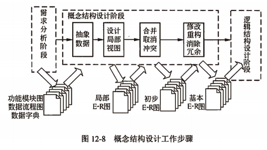

title:: 软件系统分析与设计/数据库分析与设计/概念结构设计
alias:: 概念结构设计

- 数据库概念结构设计阶段是在需求分析的基础上，依照需求分析中的信息要求，对用户信息加以分类、聚集和概括，建立信息模型，并依照选定的数据库管理系统软件，转换成为数据的逻辑结构，再依照软硬件环境，最终实现数据的合理存储。这一过程也称为数据建模。
- 概念结构设计的目标是产生反映系统信息需求的数据库概念结构，即概念模式。概念结构是独立于支持数据库的DBMS和使用的硬件环境的。此时，设计人员从用户的角度看待数据以及数据处理的要求和约束，产生一个反映用户观点的概念模式，然后再把概念模式转换为逻辑模式。
- ## 概念结构设计策略与方法
	- 概念结构设计是设计人员以用户的观点，对用户信息的抽象和描述，从认识论的角度来讲，是从现实世界到信息世界的第一次抽象，并不考虑具体的数据库管理系统。
	- 现实世界的事物纷繁复杂，即使是对某一具体的应用，由于存在大量不同的信息和对信息的各种处理，也必须加以分类整理，理清各类信息之间的关系，描述信息处理的流程，这一过程就是概念结构设计。
	- 概念结构设计的策略通常有以下4种：==自顶向下==、==自底向上==、==逐步扩张==和==混合策略==。实际应用中这些策略并没有严格的限定，可以根据具体业务的特点选择，如对于组织机构管理，因其固有的层次结构，可采用自顶向下的策略；对于已实现计算机管理的业务，通常可以以此为核心，采取逐步扩张的策略。
	- 概念结构设计最著名、最常用的方法是P.P.S Chen于1976年提出的实体-联系方法（Entity-Relationship Approach，E-R）方法。它采用E-R模型将现实世界的信息结构统一由实体、属性以及实体之间的联系来描述。
	- 使用E-R方法，无论是哪种策略，都要对现实事物加以抽象认识，以E-R图的形式描述出来。
- ## 用E-R方法建立概念模型
	- E-R图的设计要依照上述的抽象机制，对需求分析阶段所得到的数据进行分类、聚集和概括，确定实体、属性和联系。概念结构的具体工作步骤包括选择局部应用、逐一设计分E-R图和E-R图合并，如图12-8所示。
	  
		- > 1. ==选择局部应用==。需求分析阶段会得到大量的数据，这些数据分散杂乱，许多数据会应用于不同的处理，数据与数据之间关联关系也较为复杂，要最终确定实体、属性和联系，就必须根据数据流图这一线索理清数据。
		  > 数据流图是对业务处理过程从高层到底层的一级抽象，高层抽象流图一般反映系统的概貌，对数据的引用较为笼统，而底层又可能过于细致，不能体现数据的关联关系，因此要选择适当层次的数据流图，让这一层的每一部分对应一个局部应用，实现某一项功能。从这一层入手，就能很好地设计分E-R图。
		- > 2. ==逐一设计分E-R图==。划分好各个局部应用之后，就要对每一个局部应用逐一设计分E-R图，又称为局部E-R图。对于每一局部应用，其所用到的数据都应该收集在数据字典中，依照该局部应用的数据流图，从数据字典中提取出数据，使用抽象机制确定局部应用中的实体、实体的属性、实体标识符及实体间的联系及其类型。
		  > 事实上，在形成数据字典的过程中，数据结构、数据流和数据存储都是根据现实事物来确定的，因此都已经基本上对应了实体及其属性，以此为基础，加以适当调整，增加联系及其类型，就可以设计分E-R图。
	- 现实生活中，许多事物作为实体还是属性没有明确的界定，这需要根据具体情况而定，一般遵循以下两条准则。
	  > 1. 属性不可再分，即属性不再具有需要描述的性质，不能有属性的属性。
	  > 2. 属性不能与其他实体发生联系，联系是实体与实体间的联系。
- ## E-R图合并
	- 根据局部应用设计好各局部E-R图之后，就可以对各分E-R图进行合并。合并的目的在于在合并过程中解决分E-R图中相互间存在的冲突，消除分E-R图之间存在的信息冗余，使之成为能够被全系统所有用户共同理解和接受的统一的、精炼的全局概念模型。合并的方法是将具有相同实体的两个或多个E-R图合而为一，在合成后的E-R图中把相同实体用一个实体表示，合成后的实体的属性是所有分E-R图合而为一，在合成后的E-R图中把相同实体用一个实体表示，合成后的实体的属性是所有分E-R图中该实体的属性的并集，并以此实体为中心，并入其他所有分E-R图。再把合成后的E-R图以分E-R图看待，合并剩余的分E-R图，直至所有的E-R图全部合并，就构成一张全局E-R图。
	- 分E-R图之间的冲突主要有以下三类：
	  > 1. ==属性冲突==。同一属性可能会存在于不同的分E-R图，由于设计人员不同或是出发点不同，对属性的类型、取值范围和数据单位可能会不一致，这些属性对旧的数据将来只能以一种形式在计算机中存储，这就需要在设计阶段进行统一。
	  > 2. ==命名冲突==。相同意义的属性，在不同的分E-R图上有着不同的命名，或是名称相同的属性在不同的分E-R图中代表着不同的意义，这些也要进行统一。
	  > 3. ==结构冲突==。同一实体在不同的分E-R图中有不同的属性，同一对象在某一分E-R图中被抽象为实体，而在另一分E-R图中又被抽象为属性，需要统一。
	- 分E-R图的合并过程中要对其进行优化，具体可以从以下几个方面实现。
	  > 1. ==实体类型的合并==。两个具有1:1联系或1:n联系的实体可以予以合并，使实体个数减少，有利于减少将来数据库操作过程中的连接开销。
	  > 2. ==冗余属性的消除==。一般在各分E-R图中的属性是不存在冗余的，但合并后就就可能出现冗余。因为合并后的E-R图中的实体继承了合并前该实体在分E-R图中的全部属性，属性间就可能存在冗余，即某一属性可以由其他属性确定。
	  > 3.==冗余联系的消除== 。在分E-R图合并过程中，可能会出现实体联系的环状结构，即某一实体A与另一实体B间有直接联系，同时A又通过其他实体与实体B发生间接联系。通常直接联系可以通过间接联系所表达，可消除直接联系。