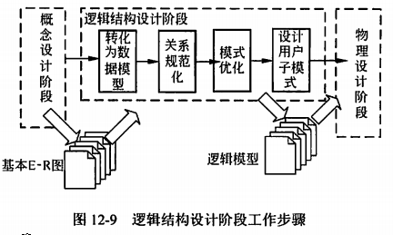

title:: 软件系统分析与设计/数据库分析与设计/逻辑结构设计
alias:: 逻辑结构设计

- 逻辑结构设计即是在概念结构设计的基础上进行数据模型设计，可以是层次模型、网状模型和关系模型，本节介绍如何在全局E-R图基础上进行关系模型的逻辑结构设计。逻辑结构设计阶段的主要工作步骤包括确定数据模型、将E-R图转换成为指定的数据模型、确定完整性约束和确定用户视图，如图12-9所示。
  
- ## E-R图关系模式的转换
	- E-R方法所得到的全局概念模型是对信息世界的描述，并不适用于计算机处理，为适合关系数据库系统的处理，必须将E-R图转换成关系模式。E-R图是由实体、属性和联系三要素构成，而关系模型中只有唯一的结构——关系模式，通常采用以下方法加以转换。
	- ### 实体向关系模式的转换
	  collapsed:: true
		- 将E-R图中的实体逐一转换成为一个关系模式，实体名对应关系模式的名称，实体的属性转换成关系模式的属性，实体标识符就是关系的码。
	- ### 联系向关系模式的转换
	  collapsed:: true
		- E-R图中的联系有三种：一对一联系（1：1）、一对多联系（1：n）和多对多联系（m：n），针对这三种不同的联系，转换方法如下。
			- ==一对一联系的转换==。一对多联系有两种方式向关系模式进行转换。一种方式是将联系转换成一个独立的关系模式，关系模式的名称取联系的名称，关系模式的属性包括该联系所关联的两个实体的码及联系的属性，关系的码取自任一方实体的码；另一种方式是将联系归并到关联的两个实体的==任一方==，给待归并的一方实体属性集中增加另一方实体的码和该联系的属性即可，归并后的实体码保持不变。
			- ==一对多联系的转换==。一对多联系有两种方式向关系模式进行转换。一种方式是将联系转换成一个独立的关系模式，关系模式的名称取联系的名称，关系模式的属性取该联系所关联的两个实体的码及联系的属性，关系的码是多方实体的码；另一种方式是将联系归并到关联的两个实体的==多方==，给待归并的多方实体属性集中增加一方实体的码和该联系的属性即可，归并后的多方实体码保持不变。
			- ==多对多联系的转换==。多对多联系只能转换成一个独立的关系模式，关系模式的名称取联系的名称，关系模式的属性取该联系所关联的两个多方实体的码及联系的属性，关系的码是多方实体的码构成的属性组。
- ## 关系模式的规范化
	- 由E-R图转换得来的初始关系模式并不能完全符合要求，还会有数据冗余、更新异常存在，这就需要经过进一步的规范化处理，具体步骤如下。
		- > 1. ==根据语义确定各关系模式的数据依赖==。在设计的前一阶段，只是从关系及其属性来描述关系模式，并没有考虑到关系模式中的数据依赖。关系模式包含着语义，要根据关系模式所描述的自然语义写出关系数据依赖。
		  > 2. ==根据数据依赖确定关系模式的范式==。由关系的码及数据依赖，根据规范化理论，就可以确定关系模式所属的范式，判定关系模式是否符合要求，即是否达到了3NF或4NF。
		  > 3. 如果关系模式不符合要求，要==根据关系模式的分解算法对其进行分解==，达到3NF、BCNF或4NF。
		  > 4. ==关系模式的评价及修正==。根据规范化理论，对关系模式分解之后，就可以在理论上消除冗余和更新异常。但根据处理要求，可能还需要增加部分冗余以满足处理要求，这就需要作部分关系模式的处理，分解、合并或增加冗余属性，提高存储效率和处理效率。
- ### 确定完整性约束
	- 根据规范化理论确定了关系模式之后，还要对关系模式加以约束，包括数据项的约束、表级约束及表间约束，可以参照SQL标准来确定不同的约束，如检查约束、主码约束和参照完整性约束，以保证数据的正确性。
- ### 用户视图的确定
	- 确定了整个系统的关系模式之后，还要根据数据流图及用户信息建立视图模式，提高数据的安全性和独立性。
		- 1. ==根据数据流图确定处理过程使用的视图==。数据流图是某项业务的处理，使用了部分数据，这些数据可能要跨越不同的关系模式，建立该业务的视图，可以降低应用程序的复杂性，并提高数据的独立性。
		- 2. ==根据用户类别确定不同用户使用的视图==。不同的用户可以处理的数据可能只是整个系统的部分数据，而确定关系模式时并没有考虑这一因素，如学校的学生管理，不同的院系只能访问和处理自己的学生信息，这就需要建立针对不同院系的视图达到这一要求，这样可以在一定程度上提高数据的安全性。