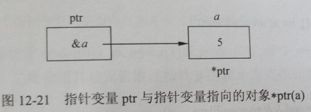
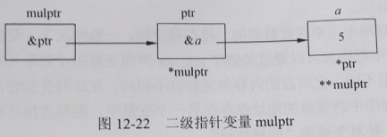
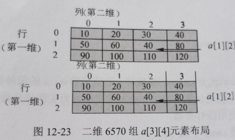
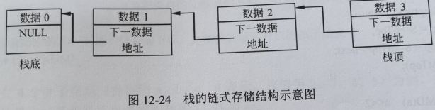
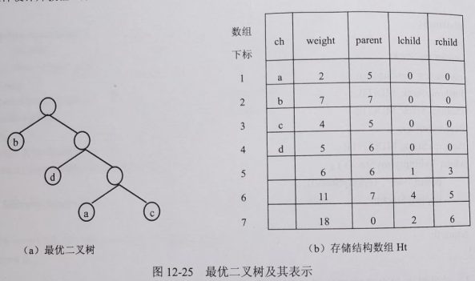
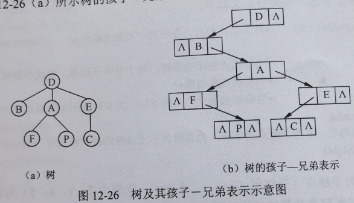
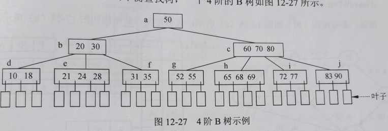
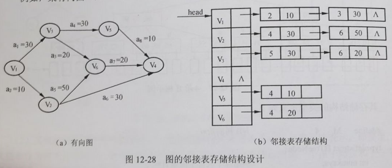
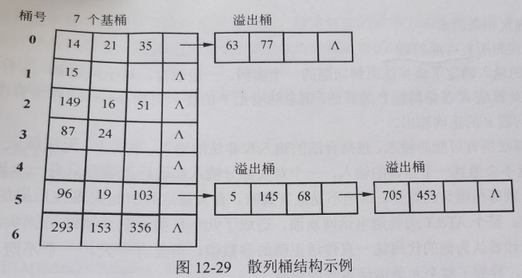

- C语言是面向过程程序设计中的典型语言，它提供了丰富的数据类型、运算符号和灵活的控制语句，熟悉C语言提供的数据类型、运算符号和语句是进行C程序设计的最基本要求。合理使用数据类型和控制结构对软件的可维护性、可扩展性有重要作用。由于篇幅限制，本节不介绍C语言的基本语法，只介绍C语言中的一个核心概念，即指针。
- 指针是C语言的精华部分，它极大地丰富了C语言的功能。通过利用指针，可以描述复杂的数据结构，在编程时能很好地利用内存资源，使其发挥最大的效率。运用指针编程是C语言最主要的风格之一。
- ## 指针类型
	- ### 变量和指针
	  collapsed:: true
		- 在程序中定义或说明的变量，编译系统为其分配相应的内存单元，也就是说，每个变量都有具体的地址。简单而言，程序语言中的变量就是内存单元的抽象。变量具有类型、值、地址、作用域和生存期等属性。
		- 变量的本质是程序中用来存放数据的一段存储空间。一般情况下，变量所对应的存储空间在内存区域，C语言中程序员可以通过关键字register声明变量的存储单元是CPU中的寄存器。
		- 变量的数据类型不同，它所占的内存单元也不相同。在访问变量时，首先应找到其在内存的地址。如果在程序中将变量的地址保存在另一个变量中，则形成指针变量，通过指针对所指向变量的访问是一种对变量的“间接访问”。
		- 例如，下面定义两个变量：整型变量a和指针变量ptr，在存取变量a中的数据时，可通过变量a或指向变量a的指针来进行，分别称为直接访问和间接访问。
		  collapsed:: true
			- ```
			  int a;
			  int *ptr;
			  // 直接访问变量a中的数据
			  a = 5;
			  a + 10;
			  // 间接访问变量a中的数据
			  ptr = &a;
			  *ptr = 5;
			  ```
		- 经上述定义和处理后，变量a和指针变量ptr之间的关系如图12-21所示。
		  collapsed:: true
			- {:height 133, :width 358}
		- 若指针变量指向的对象仍然是一个指针变量，则称为 **多级指针**。
		- 例如，对于下面的变量定义，mulptr是指向指针变量ptr的变量，这些变量间的关系如图12-22所示。
		  collapsed:: true
			- ```
			  int a, *ptr = &a, **mulptr = &ptr;
			  ```
			- {:height 131, :width 348}
		- 根据应用的需要，可以采用三级或多级指针。当然，采用多级指针在带来灵活性的同时降低了对数据的访问效率。
	- ### 通过指针访问数组中的元素
	  collapsed:: true
		- C程序中常利用指针对数组和字符串进行处理。一个数组由连续的一块内存单元组成，数组名就是这块连续内存单元的首地址（起始地址）。一个数组是由各个数组元素（通过下标区分）组成的，每个数组元素按其类型不同占有若干个连续的内存单元。
		- 通过指针访问数组元素是指针变量的一种常见的应用方式。
		  collapsed:: true
			- （1）指针变量与一维数组。指针变量指向一维数组元素的情形较为简单。C语言中定义一个指向数组元素的指针变量的方法如下。例如，定义一个整型数组st和指向元素的指针ptr。
				- ```
				  int st[10];
				  int *ptr = &st[0];
				  ```
				- 若ptr指向数组的第一个元素（即下标为0的元素），则*(p+i)指向数组的第i+1个元素（即下标为 i 的元素）。
				- 例如，设数组a的空间足够大，函数 `InsertElem(int a[], int n, int newElem)` 的功能是将newElem中的数值插入到元素已经按照非递减方式排序的数组a中，并保持数组a中数据的排序特性。其中，对数组元素的访问采用指针方式。
				- ```c
				  void InsertElem(int a[], int n, int newElem)
				  {
				  int *p, *end;
				  end = a;
				  for(p = &a[n-1];p >= end && *p > newElem; --p) 
				  	*(p+1) = *p;
				  *(p+1) = newElem;
				  }
				  ```
			- （2）指针变量与二维数组。指针变量指向二维数组元素的情形比较复杂，下面简单说明。设有定义`int a[3][4]`，其元素布局如图12-23所示。
				- {:height 228, :width 373}
				- 数组a[3][4]可看作是由3个一维数组（a[0]、a[1]、a[2]）构成的一维数组，每个一维数组的元素是4个。a是二维数组名，它代表整个二维数组的首地址。
				- a[0]是第0个一维数组的数组名和首地址。`*(a+0)`、`*a`和`a[0]`是等效的，它们都表示一维数组a[0]的0号元素的首地址。`&a[0][0]`表示a的第0行第0列元素的首地址。因此，`a`、`a[0]`、`*(a+0)`和`&a[0][0]`所表示的内容相同。
				- 同理，a[1]是第1个一维数组的数组名和首地址。将二维数组a[3][4]看作元素是一维数组的一维数组时，a是数组首地址，a+1则是1号元素的地址，也就是a[1]的地址，因此，`a+1`、`a[1]`、`*(a+1)`和`&a[1][0]`的含义相同，它们都表示数组a第1行中第0个元素的地址。
				- 所以，对于二维数组`a[M][N]`，`a+i`、`a[i]`、`*(a+i)`和`&a[i][0]`是等同的。
				- 把二维数组a[3][4]分解为一维数组a[0]、a[1]、a[2]之后，设p为指向二维数组的指针变量。可定义为：
				  ```
				  int (*p)[4]; /* p是一个指针变量，它指向包含4个元素的一维数组 */
				  ```
				- 因此，可令`p=a`（等价于`p=&a[0]`）或`p=&a[1]`或`p=&a[2]`。若令`p=&a[0]`，则`*(*(p+1)+2)`就表示数组元素`a[1][2]`，二维数组其他元素通过指针p的表示方式依此类推。
	- ### 指针与函数
	  collapsed:: true
		- C程序中将指针与函数结合使用的常见方式有函数参数为指针、函数返回值为指针以及通过函数指针变量调用函数（函数指针变量）。
		- #### 函数参数为指针
			- 函数的参数不仅可以是整型、实型、字符型等基本数据类型，还可以是指针类型。参数使用指针类型的作用是将一个变量的地址传送到另一个函数中。
			- C语言中实参向形参传递值，反之则不行。
			- 例如，定义函数swap_1(a,b) 的功能是交换 a 和 b 的值，代码如下：
			  ```c
			  void swap_1(int a, int b) {
			  	int temp;
			    temp = a; a = b; b = temp;
			  }
			  ```
			- 如果发生函数调用 swap_1(x,y)，则系统将x的值传给a、y的值传给b，在函数 swap_1 中实现了a和b的值交换，但是 x 和 y 的值并不发生交换。为实现将函数中对形参的修改结果返回给调用函数之处，可使用指针参数。
			- 对于上例，定义函数 swap_2 如下：
			  ```c
			  void swap_2(int *a, int *b) {
			    int temp;
			    temp = *a; *a = *b; *b = temp;
			  }
			  ```
			- 当形式参数为指针类型时，传递给形参的应该是地址信息，因此调用 swap_2 的形式为 swap_2(&x,&y)。这样通过“间接访问”，实现了在被调用函数中修改实参所对应的变量。
			- 通过指针参数也可以实现将被调用函数中的多个处理结果传回给调用函数的地方。
			- 当函数的参数为数组时，实参和形参既可以用指针形式，也可以用数组形式，实参向形参传递的是数组空间的首地址。
		- #### 函数返回值为指针
			- 函数类型是指函数返回值的类型。在C语言中允许一个函数的返回值是一个指针（即地址），这种返回指针值的函数称为指针型函数。
			- 需要注意的是，不能返回局部数据的指针。
			- 例如，下面的函数 get_str 虽然返回了==局部数组==str的首地址，但调用 get_str 的其他函数并不能通过此地址访问字符串“testing local pointer”。
			  ```c
			  char* get_str(void) {
			    char str[] = {"testing local pointer"};
			    return str;
			  }
			  int main() {
			    char *p;
			    int i;
			    p = get_str();
			    for(i = 0; *(p+1); i++)
			      putchar(*(p+1));
			    return 0;
			  }
			  ```
			- 将上述函数 get_str 中的 `char str[] = {"testing local pointer"};` 改为 `char *str = {"testing local pointer"};` 即可，或者从内存的堆区申请字符串的空间，然后返回首地址。
			  ```c
			  char* get_str(void) {
			    char *str;
			    str = (char *)malloc(100);
			    if (!str)
			      return NULL;
			    strcpy(str, "testing local pointer");
			    return str;
			  }
			  ```
			- 函数返回值为指针时，也可以实现将被调用函数中的多个处理结果传回给调用函数的地方。
		- #### 指针变量
			- 程序中的一个函数总是占用一段连续的内存区，而函数名就是该函数所占内存区的首地址。可以把函数的首地址（或称入口地址）赋给一个指针变量，使指针变量指向该函数，然后通过指针变量就可以找到并调用这个函数。指向函数的指针变量称为“函数指针变量”。
			- 函数指针变量定义的一般形式为：
			  ```
			  类型说明符 (*指针变量名)();
			  ```
			- 其中，“类型说明符”表示被指函数的返回值的类型；“(*指针变量名)”表示“*”后面的变量是指针变量；最后的一对空括号表示指针变量所指向的对象是一个函数。
			- 例如，下面定义了一个函数指针变量funptr。
			  ```c
			  int (*funptr)(); /* 指针变量funptr指向的对象是一个返回值为整数的函数 */
			  ```
			- 下面的程序中先定义了一个函数 max(a,b)，其功能是比较用 a 和 b 表示的两个整数并返回它们中的较大者，然后通过函数指针变量调用max。
			  ```c
			  #include <stdio.h>
			  int max(int a, int b) {
			    if (a > b) return a;
			    else return b;
			  }
			  int main() {
			    int max(int a, int b); /* 声明max是具有两个整型参数、返回值为整数的函数 */
			    int(*funptr)();
			    int x,y,z;
			    
			    funptr = max; /* 令funptr指向函数max */
			    printf("input two numbers:\n");
			    scanf("%d%d", &x, &y);
			    z = (*funptr)(x,y); /* 等价于 z=max(x,y) */
			    printf("maxmum=%d", z);
			    return 0;
			  }
			  ```
			- 既然函数指针变量是一个变量，当然也可以作为某个函数的参数来使用。例如，下面的程序中设计了一个testFunCall函数，该函数根据其函数指针参数值的不同分别调用函数fun1和函数fun2（注：fun1和fun2的定义形式应相同）。
			  ```c
			  int fun1(int x);
			  int fun2(int x);
			  typedef int (*FunType)(int); /* 定义一个函数指针类型FunType */
			  void testFunCall(FunType fp, int x);
			  int main() {
			    testFunCall(fun1,10); /* 通过testFunCall调用函数fun1 */
			    testFunCall(fun2,20); /* 通过testFunCall调用函数fun2 */
			    return 0;
			  }
			  void testFunCall(FunType fp, int x) {
			    int t;
			    t = fp(x); /* 通过函数指针fp调用fp指向的函数 */
			    printf("restul: %d\n", t);
			  }
			  int fun1(int x) {
			    int t;
			    t = x * x;
			    printf("函数fun1的参数为：%d\t 返回值为：%d\n", x, t);
			    return t;
			  }
			  int fun1(int x) {
			    int t;
			    t = (int)sqrt(x);
			    printf("函数fun2的参数为：%d\t 返回值为：%d\n", x, t);
			    return t;
			  }
			  ```
- ## 指针与数据结构
	- “程序=数据结构+算法”常用来说明程序、数据结构（数据的存储结构）与算法之间的关系，指针在数据结构的设计和实现中有重要的作用。随着软件开发环境的不断完善和程序语言的抽象程度不断提高，数据结构的内部设计细节被封装和屏蔽起来，在很多应用软件的开发中没有必要也不再涉及底层细节，但是在系统级程序设计或嵌入式应用的软件设计中，指针及相关机制的应用仍然是十分重要的。
	- ### 单链表的实现和应用
		- 在数据结构的设计中，指针是常用的工具。对于无法预先确定数据规模的应用，可采用动态存储的方法解决数据的存储问题，也就是链表结构。链表中的每个结点之间可以是地址不连续的（结点内是连续的），结点之间的联系用指针实现，实际上是在结点结构中定义一个成员项来存放下一结点的首地址，称为指针域。
		- C语言标准库中提供的用于申请动态存储空间的函数是 malloc()、calloc() 和 realloc()，函数 free() 用于释放由上述函数申请的内存空间。
		- ==栈==是一种常用的数据结构，下面设计并实现一个链表结构的栈，如图12-24所示（为了简化，栈中的元素类型设为int型）。
			- {:height 123, :width 463}
			- ```c
			  typedef struct Node {
			    int data; /* 栈中的数据元素 */
			    struct Node* next; /* 上次入栈的数据元素结点的地址 */
			  } Node;
			  typedef struct Stack {
			    Node * pTop; /* 栈顶指针 */
			  } Stack;
			  Stack* NewStack() {
			    return (Stack*)calloc(1,sizeof(Stack));
			  }
			  int IsEmpty(Stack* S) {
			    if (S == NULL || S->pTop == NULL) return 1;
			    return 0;
			  }
			  int Top(Stack* S) {
			    if (IsEmpty(S))
			        return INT_MIN;
			    return S->pTop->data;
			  }
			  void Push(Stack* S, int theData) {
			    Node* newNodePtr;
			    newNodePtr = (Node *)malloc(sizeof(Node));
			    newNodePtr->data = theData;
			    newNodePtr->next = S->pTop;
			    S->pTop = newNodePtr;
			  }
			  void Pop(Stack* S) {
			    Node* lastTop;
			    if(IsEmpty(S)) return;
			    lastTop => S->pTop;
			    S->pTop = S->pTop->next;
			    free(lastTop);
			  }
			  #define MD(a) a << 2
			  int main() {
			    int i;
			    Stack* myStack;
			    myStack = NewStack();
			    Push(myStack, MD(1));
			    Push(myStack, MD(2));
			    Pop(myStack);
			    Push(myStack, MD(3) + 1);
			    while(!IsEmpty(myStack)) {
			      printf("%d", Top(myStack));
			      Pop(myStack);
			    }
			    return 0;
			  }
			  ```
	- ### 二叉链表和多叉链表的设计和应用
		- #### 二叉树的存储结构设计
			- 二叉树是一种重要的数据结构，采用二叉链表存储时，其结点的类型常定义为：
			  ```c
			  typedef struct Tnode {
			    ElemType data; /* 结点的数据，ElemType是其类型的抽象表示 */
			    struct Tnode *Lchild, *Rchild; /* 指向结点左、右孩子的指针 */
			  } *Bitree;
			  ```
			- 对于某些特殊的二叉树，如哈夫曼树（或称为最优二叉树），由于该类型二叉树的内部结点是由初始的m个叶子结点根据一定的规则构成的，因此其结点总数总是2m-1，所以采用静态的三叉链表来表示，其类型定义如下：
			  ```c
			  #define LEAFNUM 20 /* 叶子结点数目，在应用中可预先确定 */
			  struct node {
			    char ch; /*  */
			    int weight; /**/
			    int parent; /**/
			    int lchild, rchild; /**/
			    /**/
			  } Ht[2* LEAFNUM];
			  ```
			- 以具有4个叶子结点（分别用a、b、c、d表示，权值为2、7、4、5）为例，采用哈夫曼算法构造的最优二叉树及其存储结构如图12-25所示。
			- {:height 299, :width 494}
		- #### 其他树结构的存储结构设计
			- 一般的树结构常采用孩子-兄弟表示法表示，即采用二叉链表作为树的存储结构，链表中结点的两个链域分别指向该结点的第一个孩子结构和下一个兄弟结点。结点类型定义如下：
			  ```c
			  typedef struct Node {
			    ElemType data;
			    struct Node *firstchild, *nextbrother;
			  } Node, *TreeNode;
			  ```
			- 例如，图12-26（a）所示树的孩子-兄弟表示如图12-26（b）所示。
			- {:height 270, :width 456}
			- 显然，在物理上，表示一般二叉树的二叉链表与树的孩子-兄弟表示法的结构是相同的，其差别在于对指针所指对象的解释，也就是在逻辑上进行区分。
			- B树是适用于外部查找的平衡查找树，一个4阶的B树如图12-27所示。
			- {:height 208, :width 618}
			- 其存储结构的类型定义如下。
			  ```c
			  #define M 4 /* B树的阶 */
			  typedef struct BTreeNOde {
			    int numkeys; /* 结点中关键字的数目 */
			    struct BTreeNode *parent; /* 指向父结点的指针，树根的父结点指针为空 */
			    struct BTreeNode *A[M]; /* 指向子树结点的指针数组 */
			    ElemKeyType K[M]; /* 存储关键字的数组，K[0]闲置不用 */
			  } BTreeNode;
			  ```
		- #### 其他链表的设计和应用
			- 图也可以采用链表存储结构，称为邻接表，其数据类型定义如下：
			  ```c
			  typedef struct Gnode { /* 邻接表的表结点类型 */
			    int adjvex; /* 邻接顶点编号 */
			    int weight; /* 弧上的权值 */
			    struct Gnode *nextarc; /* 指示下一个弧的结点 */
			  }
			  typedef struct Adjlist { /* 邻接表的头结点类型 */
			    char vdata; /* 顶点的数据信息 */
			    struct Gnode *Firstadj; /* 指向邻接表的第一个表结点 */
			  }AdjList;
			  typedef struct LinkedWDigraph { /* 图的类型 */
			    int n, e; /* 图中顶点数据和边数据 */
			    struct AdjList *head; /* 指向图中第一个顶点邻接表的头结点的指针 */
			  }
			  ```
			- 例如，某有向图（网）如图12-28（a）所示，其邻接表存储结构如图12-28（b）所示。
			- {:height 246, :width 560}
			- 在散列技术中，可用拉链法将冲突的元素存储起来，实际上就是链表结构的一个应用。例如，可以设计散列桶结构的类型如下：
			  ```c
			  #define NULLKEY -1 /* 散列桶的空闲单元标识 */
			  #define Pnum 7 /* 散列文件中基桶的数目 */
			  #define ITEMS 3 /* 基桶和溢出桶的容量 */
			  typedef struct BucketNode { /* 基桶和溢出桶的类型定义 */
			    int KeyData[ITEMS];
			    struct BucketNode *Link;
			  }BUCKET;
			  BUCKET Bucket[Pnum]; /* 基桶空间定义 */
			  ```
			- 设散列函数为`Hash(key)=Key mod 7`，关键字序列“15，14，21，87，96，293，35，24，149，19，63，16，103，77，5，153，145，356，51，68，705，453”的存储结构如图12-29所示。
			- {:height 259, :width 467}
			- 从上述内容可知，利用指针实现的链表结构有灵活多变的形式，可根据应用的需要为数据存储设计不同的结构。显然，数据的存储方式不同，体现相同算法思路的处理过程可能会有较大的差异。因此，算法的实现过程与数据结构的设计是密切相关的，在有些情况下，算法的实际效率会因为数据存储结构的不同而不同。