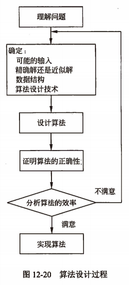

title:: 软件系统分析与设计/算法分析与设计
alias:: 算法分析与设计

- ## 算法与软件系统
	- 算法的概念在计算机科学领域几乎无处不在，在各种计算机软件系统的实现中，算法设计往往处于核心地位。例如，操作系统是现代计算机系统中不可缺少的系统软件，其中的各个任务都是一个单独的问题，每个问题由一个子程序根据特定的算法来实现。
	- 尽管对有些应用来说，在应用这一层面上没有什么特别明显的算法方面的要求（例如，一些简单的Web应用），但是大多数问题对算法还是有一定要求的。例如，假设有一种基于Web的服务，用于确定如何从一个地方旅行到另一个地方。其实现依赖于快速的计算机硬件、图形用户界面（GUI）、广域网技术，甚至还可能要依赖于面向对象技术。除此之外，它还需要某些操作设计算法，如寻找路由（最短路径算法）、显示地图和插入地址等。
	- 此外，即使那些在应用层面上对算法性内容没有什么要求的应用，其实也是相当依赖于算法的，
	  该应用是否要依赖于快速的计算机硬件？硬件的设计就要用到算法。
	  该应用是否要用到图形用户界面？GUI的设计也要依赖于算法。
	  该应用是否要依赖于网络技术？网络路由对算法也有很大的依赖。
	  该应用是否采用某种非机器代码的语言编写？那么，它就要由编译器、解释器或汇编器来处理，所有这些软件都要大量用到各种算法。
	  因此，每个软件系统都会直接或者间接地涉及到算法理论，算法是当代计算机中用到的大部分技术的核心。
	- 随着计算机性能的不断增长，有人可能认为，算法的研究已经不是那么重要了。但是想一想，计算机可以做得很快，但还不能是无限快。存储器可以做得很便宜，但不会是免费的。因此，计算时间是一种有限的资源，存储空间也是一种有限的资源，在开发软件系统时，这些有限的资源应该得到有效的利用。而且，正是由于计算机性能的不断增长，可以利用计算机来解决更复杂的问题，或者规模更大的问题。因此，算法的研究是必要的，它是推动计算机技术发展的关键。
	- _正如第9章提到的，算法理论的研究主要包括算法设计技术和算法分析技术，这两者是不可分割的一个整体。算法设计要设计出针对问题的高质量的算法，算法分析的对象是被设计出的算法，并研究算法所耗费的计算资源与问题规模之间的函数关系，而每一个被设计出的算法只有经过算法分析，才能评价其质量的优劣。_
	- _因此，用什么方法来设计算法，如何判定一个算法的优劣，所设计的算法需要占用多少时间资源和空间资源，在实现一个软件系统时，都是必须予以解决的重要问题。_
	- 另外，算法只有经过某种程序设计语言实现，才能在计算机上运行，才能真正地解决问题，因此，本节的内容包括两个部分：C程序设计语言与实现和算法设计与实现。
- ## ~~算法设计过程~~
  collapsed:: true
	- 算法是问题的解决方案，这个解决方案本身并不是问题的答案，而是能获得答案的指令序列。不言而喻，由于实际问题千奇百怪，问题求解的方法千变万化，所以，算法的设计过程是一个灵活的充满智慧的过程，它要求设计人员根据实际情况具体问题具体分析。可以肯定的是，设计算法是一个非常有创造性和值得付出精力的过程。
	- 在设计算法时，有几个问题的要考虑到的：如何设计算法？如何表示算法？如何证明问题解决的正确性？如何评估算法的效率？如何进行算法的最优化？根据这些问题，可以归纳出算法设计的主要步骤：理解问题；确定相关因素，包括问题的输入与输出、用何种数据结构、用什么样的算法设计策略等；设计算法；证明所设计的算法的正确性；分析所设计的算法的效率；实现所设计的算法。
	- ### 理解问题
	  collapsed:: true
		- 在面对一个算法任务时，算法设计者往往不能准确地理解要求他做的是什么。对算法希望实现什么只有一个大致的想法就匆忙地落笔写算法，其后果往往是写出的算法漏洞百出。在设计算法时需要做的第一件事就是完全理解要解决的问题，仔细阅读问题的描述，手工处理一些小例子。
		- 对设计算法来说，这是一项重要的技能。准确地理解算法的输入是什么？要求算法做的是什么？即明确算法的入口和出口，这是设计算法的切入点。
	- ### 确定相关因素
	  collapsed:: true
		- #### 预测所有可能的输入
			- 算法的输入确定了该算法所解问题的一个实例。一般而言，对于问题P，总有其相应的实例集I，因此算法A若是问题P的算法，则意味着把P的任一实例 input \in I 作为算法A的输入，都能得到问题P的正确输出。
			- 预测算法所有可能的输入，包括合法的输入和非法的输入。事实上，无法保证一个算法（或程序）永远不会遇到一个错误的输入，一个对大部分输入都运行正确而只有一个输入不行的算法，就像一颗等待爆炸的炸弹。这绝不是危言耸听，有大量这种引起灾难性后果的案例。例如，许多年以前，整个AT&T的长途电话网崩溃，造成了几十亿美元的直接经济损失。原因只是一段程序的设计者认为他的代码能一直传送正确的参数值，可是有一天，一个不应该有的值作为参数传递了，导致了整个北美电话系统的崩溃。
			- 如果养成习惯——首先考虑问题和它的数据，然后列举出算法必须处理的所有特殊情况，那么可以更快速地成功构造算法。
		- #### 在精确解和近似解间做选择
			- 在精确解和近似解间做选择。计算机科学的研究目标是用计算机来求解人类所面临的各种问题。但是，有些问题无法求得精确解，例如求平方根、解非线性方程和求定积分等。有些问题由于其固有的复杂性，求精确解需要花费太长的时间，其中最著名的要算旅行商问题（TSP问题），此时，只能求出近似解。
			- 有时需要根据问题以及问题所受的资源限制，在精确解和近似解间做选择。
		- #### 确定适当的数据结构
			- 在结构化程序设计时代，著名的计算机学者沃思(Wirth)提出了“算法+数据结构=程序”的观点，断言了算法和数据结构是构成计算机程序的重要基础。在面向对象的程序设计时代，数据结构对于算法设计和分析仍然是至关重要的。
			- 确定数据结构通常包括对问题实例的数据进行组织和重构，以及为完成算法所设计的辅助数据结构。在很多情况下，数据结构的设计直接影响基于该结构之上设计的算法的时间性能。
		- #### 确定算法设计技术
			- 第9章介绍的算法设计技术（或称为算法设计策略）是设计算法的一般性方法，可用于解决不同计算领域的多种问题。这些算法设计技术包括分治法、动态规划法、贪心算法、回溯法、分支限界法、概率算法和近似算法等，已经被证明是对算法设计非常有用的通用技术，它们构成了一组强有力的工具，在为新问题设计算法时，可以运用这些技术设计出新的算法。算法设计技术作为问题求解的一般性策略，在解决计算机领域以外的问题时，也能发挥相当大的作用。
	- ### 设计算法
	  collapsed:: true
		- 根据1）和2）的结果，就可以设计算法。在构思和设计了一个算法之后，必须清楚准确地将所设计的求解步骤记录下来，即描述算法。描述算法的常用方法有自然语言、流程图、程序设计语言和伪代码等，其中伪代码是比较合适的描述算法的方法。
	- ### 证明算法的正确性
	  collapsed:: true
		- 可以用==循环不变式==来证明算法的正确性，以插入排序为例介绍循环不变式，以下是插入排序的伪代码（伪代码的约定参考第9章）。
		  ```c
		  INSERTION-SORT(A,n)
		    for j <- 2 to n
		      do key <- A[j]
		        ▶️Insert A[j] into the sorted sequence A[1..j-1]
		        i <- j-1
		        while i > 0 and A[i] > key
		          do A[i+1] <- A[i]
		            i <- i-1
		        A[i-1] <- key
		  ```
		- 对要分析的算法，定义循环不变式，如对插入排序，定义其外层循环不变式为：在每一轮迭代的开始，子数组A[1..j-1]中包含了最初位于A[1..j-1]，但目前已经排好序的各个元素。然后证明循环不变式的三个性质。
			- ==初始化==。在循环的第一轮迭代开始之前它是正确的。对于插入排序，每一轮迭代之前，j=2，子数组为A[1..j-1]，即A[1]，也就是最初在A[1]中的那个元素，显然这个子数组是已排好序的，因此循环不变式成立。
			- ==保持==。如果在循环和每一次迭代之前它是正确的，那么在下一次迭代之前，它也应该保持正确。对于插入排序（上述伪代码包含两重循环，应该定义两个循环不变式，并证明它们的正确性。但为了简便，暂时不陷入过于形式化的细节，仅考虑外层循环），要将A[j-1]、A[j-2]和A[j-3]等元素向右移一个位置，直到找到A[j]的适当位置为止（第4~7行），这里将A[j]的值插入（第8行）。很显然，循环不变式是成立的。
			- ==终止==。当循环结束时，循环不变式给了我们一个有用的性质，它有助于表明算法是正确的。对于插入排序，当j大于n时，外层for循环结束。在循环不变式中，将j替换为n+1，就有子数组A[1..n]包含了原先在A[1..n]中的元素，但现在已经排好序了，这意味着算法是正确的。
		- 除了循环不变式外，经验和研究表明，发现算法（或程序）中逻辑错误的重要方法就是系统地跟踪算法。跟踪必须要用”心和手”来进行，跟踪者要像计算机一样，用一组输入值来执行该算法，并且这组输入值要最大可能地暴露算法中的错误。即使有几十年经验的高级软件工程师，也经常利用此方法查找算法中的逻辑错误。
	- ### 分析算法的效率
	  collapsed:: true
		- 设计出的算法只有经过分析，才能评价其优劣，才能判断其是否能满足问题求解的需求或者在多个算法之间进行选择。算法分析主要分析两种效率：时间效率和空间效率，时间效率显示了算法运行得有多快，空间效率则显示了算法需要多少额外的存储空间，相比而言，一般更关注算法的时间效率。事实上，计算机的所有应用问题，包括计算机自身的发展，都是围绕着“时间——速度”这样一个中心进行的。一般来说，一个好的算法首先应该是比同类算法的时间效率高。
		- #### 根据算法编写代码
			- 现代计算机技术还不能将伪代码列式的算法直接“输入”进计算机中，而需要把算法转变为特定程序设计语言编写的程序，算法中的一条指令可能对应实际程序中的多条指令。在把算法转变为程序的过程中，虽然现代编译器提供了代码优化功能，但仍需要一些标准的技巧，例如，在循环体之外计算循环中的不变式、合并公共子表达式、用开销低的操作代替开销高的操作等。一般来说，这样的优化对算法速度的影响是一个常数因子，可能会使程序提高10%~50%的速度。
			- 算法设计的一般过程如图12-20。需要强调的是，一个好算法是反复努力和重复修正的结果。那么，什么时候应该停止这种改进呢？设计算法是一种工程行为，需要在资源有限的情况下，在互斥的目标之间进行权衡。设计者的时间显然也是一种资源，在实际应用中，常常是项目进度表迫使我们停止改进算法。
			  
- ## ~~算法问题类型~~
  collapsed:: true
	- 就像生物学家把自然界所有生物作为自己的研究对象，计算机科学把问题作为自己的形容对象，研究如何用计算机来解决人类所面临的各种问题。在计算领域的无数问题中，或者由于问题本身具有一些重要特征，或者由于问题具有实用上的重要性，有一些领域的问题是算法研究人员特别关注的。经验证明，无论对于学习算法还是应用算法，对这些问题的研究都是极其重要的。下面列出几类重要的问题。
	- ### 查找问题
	  collapsed:: true
		- 查找是在一个数据集合中查找满足给定条件的记录。对于查找问题来说，没有一种算法对于任何情况都是合适的。有的算法查找速度比其他算法快，但却需要较多的存储空间（例如Hash查找）；有的算法查找速度非常快，但仅适用于有序数组（例如折半查找），等等。此外，如果在查找的过程中数据集合可能频繁地发生变化，除了考虑查找操作外，还需要考虑在数据集合中执行插入和删除等操作。这种情况下，就必须仔细地设计数据结构和算法，以便在各种操作的需求之间达到一个平衡。而且，组织用于高效查找的特大型数据集合对于实际应用具有非常重要的意义。
	- ### 排序问题
	  collapsed:: true
		- 简单地说，排序就是将一个记录的无序序列调整成为一个有序序列的过程。在对记录进行排序时，需要选定一个信息作为排序的依据，例如，可以按学生平均成绩对学生记录进行排序，这个特别选定的信息（平均成绩）称为关键码。
		- 排序的一个主要目的是为了进行快速查找，这就是为什么字典、电话簿和班级名册都是排好序的。当然，在很多领域的重要算法中，排序也被作为一个辅助步骤，例如，搜索引擎将搜索到的结果按相关程序排序后显示给用户。
		- 迄今为止，已经发现的排序算法不下于几十种，没有一种排序算法在任何情况下都是最好的解决方案，有些排序算法比较简单，但速度相对较慢；有些排序算法速度较快，但却很复杂；有些排序血战上海滩地适合随机排列的输入；有些排序算法速度较快，但却很复杂；有些排序算法适合随机排列的输入；有些排序算法更适合基本有序的初始排列；有些排序算法仅适合存储在内存中的序列；有些排序算法可以用来对存储在磁盘上的大型文件排序等。
	- ### 图问题
	  collapsed:: true
		- 算法中最古老也是最令人感兴趣的领域是图问题，很多纷乱复杂的现实问题抽象出的模型都是图结构，如社会网络、Web、工作流、XML数据、电路、图像、化合物和生物网络等。作为一种通用的、复杂的数据结构，基于图的相关算法也具有十分重要的作用。
		- 有些图问题在计算上是非常困难的，这意味着，在能够接受的时间内，即使用最快的计算机，也只能解决这种问题的一个很小规模的实例，例如TSP问题、最大团问题（即最大独立集问题）、图着色问题、哈密尔顿回路问题、顶点覆盖问题和最长路径问题等。图问题中还有一个奇怪的现象：许多形式上非常类似的问题，解决它们的难度却相差很大，例如，最短路径问题和欧拉回路问题存在多项式时间算法，而最长路径问题和哈密尔顿回路问题至今没有找到一个多项式时间算法。
	- ### 组合问题
	  collapsed:: true
		- 组合问题一般都是最优化问题，因此也称为组合优化问题，即寻找一个组合对象，例如一个排列、一个组合或一个子集，这个对象能够满足特定的约束条件并使得某个目标函数取得极值：价值最大或者成本最小。典型的组合优化问题包括0-1背包问题、TSP问题和整数线性规划等。
		- 无论从理论的观点还是实践的观点，组合问题都是计算领域中最难的问题，其原因如下。
		  1. 随着问题规模的增大，组合对象的数量增长极快，即使是中等规模的实例，其组合对象的数量也会达到不可思议的数量级，产生组合爆炸。
		  2. 还没有一种已知算法能在可接受的时间内，精确地求解绝大多数问题。
	- ### 几何问题
	  collapsed:: true
		- 几何问题处理类似于点、线、面和体等几何对象。几何问题与其他问题的不同之处在于，哪怕是最简单、最初等的几何问题也难以用数字去处理。尽管人类对几何问题的研究从古代起便没有中断过，但是具体到借助计算机来解决几何问题的研究，还只是停留在一个初始阶段。随着计算机图像图形处理、机器人和断层X摄像技术等方面应用的深入，人们对几何算法产生了强烈的兴趣。经典的几何问题包括最近点对问题和凸包问题，前者指的是在给定平面上的n个点中，求距离最近的两个点；后者指的是要找出一个能把给定集合中的所有点都包含在里面的最小凸多边形。
- ## ~~现代优化计算方法~~
  collapsed:: true
	- 上述提到的组合优化问题很多都是NP-难问题，因此目前还不存在有效的算法——多项式时间算法来求解，而这些问题又是现实中人们常常遇到的、需要解决的问题。因此，计算机科学和算法研究者们致力于研究求解这些难解问题的一些可行的方法。自20世纪80年代以来得到快速发展和广泛应用的现代优化计算方法，借助现代计算机作为工具，对复杂的组合优化问题的求解具有普遍适用性。这些方法包括禁忌搜索算法（tabu search）、模拟退火算法（simulated annealing）、遗传算法（genetic algorithms）、蚁群优化算法（ant colony optimization）和人工神经网络（artificial neural networks）等。它们中的每一个算法都以人类、生物的行为方式或物质的运动形态为背景，经过数学抽象建立算法模型，通过计算机的计算来求解组合优化问题，因此这些算法也被称之为元启发式算法（meta-heuristics）。
	- ### 禁忌搜索算法
	  collapsed:: true
		- 禁忌搜索的思想最早由Glover于1986年提出，它是对局部领域搜索的一种扩展，是一种全局逐步寻优算法，是对人类智力过程的一种模拟。简单的局部领域搜索从任何一个初始解出发，达到一个局部最优解停止。因此，算法停止时得到的解依赖于算法初始解的选取、领域的结构和领域选解的规则。这个方法往往容易导致局部最优解，而难以得到全局最优解。而禁忌搜索算法引入禁忌策略尽量避免迂回搜索，并通过藐视准则来赦免一些被禁忌的优良状态，进而保证多样化的有效探索以最终实现全局优化。禁忌搜索的思想基于这样的日常生活现象：当要寻找某个东西或寻找某个地方时，对刚刚已经搜索的地方不会立即去搜索，而更大的概率是到近一段时间内没有去过的地方进行搜索，若没有找到，再搜索已经去过的地方。
		- 禁忌搜索涉及到领域函数、禁忌表、禁忌对象、禁忌长度、候选解和藐视准则等概念。通常领域函数沿用局部领域搜索的思想，以实现领域搜索；禁忌表和禁忌对象的设置，体现了算法避免迂回搜索的特点；禁忌长度决定禁忌对象的任期；候选解从当前解的领域函数产生的领域解中确定；藐视准则是对优良状态的奖励，是对禁忌策略的一种松弛，从而实现全局优化。
		- 禁忌算法的基本思想：给定一个初始解（当前解）和一种领域函数，在当前解的领域函数确定的领域解中确定若干候选解。若最佳候选解对应的目标值优于best so far状态，则忽视其禁忌特性，用其代替当前解和best so far状态，并将相应的对象加入禁忌表，同时修改禁忌表中各对象的任期。如此重复上述迭代搜索过程，直至满足停止准则。
		- 禁忌搜索算法的新解不是在当前解的领域中随机产生，而是优于best so far的解，或是非禁忌的最佳解，因此选取优良解的概率远远大于其他解。由于禁忌搜索算法具有灵活的记忆功能和藐视准则，并且在搜索过程中可以接受劣解，所以具有较强的“爬山”能力，搜索时能够跳出局部最优解，转向解空间的其他区域，从而增强获得更好的全局最优解的概率，所以禁忌搜索算法是一种局部搜索能力很强的全局迭代寻优算法。但是，禁忌搜索算法对于初始解具有较强的依赖性，一个较好的初始解可使禁忌搜索在解空间中搜索到更好的解，而一个较差的初始解则会降低禁忌搜索的收敛速度，搜索到的解也相对较差。迭代搜索过程是串行的，权是单一状态的移动，而非并行搜索，这就使得算法的优化时间往往较长。
		- 禁忌搜索算法在组合优化、生产高度、机器学习、路由选择和电路设计等领域取得了很大的成功。并且，为了进一步改善禁忌搜索算法的性能，可以对算法本身的操作和参数选择进行改进，也可以把禁忌搜索与其他启发式方法结合起来，如与模拟退火、遗传算法和人工神经网络等相结合。
	- ### 模拟退火算法
	  collapsed:: true
		- 模拟退火算法最早的思想由Metropolis在1953年提出，Kirkpatrick在1983年成功地应用在组合优化问题上。模拟退火算法是局部搜索算法的扩展，它不同于局部搜索之处是以一定的概率选择领域中较差的解。从理论上说，它是一个全局最优算法。
		- 模拟退火算法来源于物理退火过程，主要包括如下三个阶段。
		  1. 加温阶段。
		  2. 等温阶段。
		  3. 冷却阶段。
		- 模拟退火算法的基本思想：首先将固体加温至充分高，再让其徐徐冷却，加温时，固体内部粒子随温升变为无序状态，内能增大，而徐徐冷却时，粒子渐趋有序，在每个温度都达到平衡态，最后在常温时达到基态，内能减为最小。根据Metropolis准则，粒子在温度T时趋于平衡的概率为 $$e^{\frac{-\Delta E}{kT}}$$，其中E为温度T时的内能，\Delta E 为其改变量，k为Boltzmann常数 。用固体退火模拟组合优化问题，将内能E模拟为目标函数值f，温度T演化成控制参数t，即得到解组合优化问题的模拟退火算法：由初始解i和控制参数初值t开始，对当前解重复“产生新解->计算目标函数差->接受或舍弃”的迭代，并逐步衰减t值，算法终止时的当前解即为所得近似最优解，这是基于蒙特卡罗迭代求解法的一种启发式随机搜索过程。退火过程由冷却进度表控制，包括控制参数的初值t及其衰减因子\Delta t、每个t值时的迭代次数L和停止条件S。
		- 模拟退火的步骤如下。
		  1. 初始化。初始温度T（充分大），初始解状态S（是算法迭代的起点），每个T值的迭代次数L。
		  2. 对k=l，…，L进行（3）~（6）操作。
		  3. 产生新解S’。
		  4. 计算增量 $$\Delta t’ = C(S’) - C(S)$$，其中C(S)为评价函数。
		  5. 若 $$\Delta t’ \lt 0$$，则接受S’作为新的当前解：否则以概率 $$\exp(- \Delta t’/T)$$ 接受S’作为新的当前解。
		  6. 如果满足终止条件则输出当前解作为最优解，结束程序（终止条件通常取为连续若干个新解都没有被接受时终止算法）。
		  7. T逐渐减少，且T趋于0，然后转步骤（2）。
		- 模拟退火算法实质上是局部搜索算法的推广，因此它克服了局部搜索算法局部最优的缺点，但它同样也面临解的表示和领域函数的设计问题，好的设计方法能使算法在可行解域内进行搜索，否则会扩大搜索空间，增加搜索时间。同时，模拟退火算法是一种通用的、高效的、健壮的和灵活的随机近似算法，并且可以较容易地并行实现以进一步提高运行效率，适合求解大规模组合优化问题，特别是NP完全问题，因此具有很大的实用价值。此外，对模拟退火算法做一些局部或策略上的修改，还可以得到一些推广或变异形式。
	- ### 遗传算法
	  collapsed:: true
		- 遗传算法由J.Holland教授于1975年首先提出，并逐渐发展起来。“适者生存”揭示了大自然生物进化过程中的一个规律——最适合自然环境的群体往往产生了更大的后代群体。遗传算法就是基于生物界的进化规律演化而来的随机化搜索方法，其思想源于生物遗传学和适者生存的自然规律，是具有“生存+检测”的迭代过程的搜索算法。其中，选择、交叉和变异构成了遗传算法的基本操作。
		  1. 选择（也称为再生）。从群体选择出较适应环境的个体。这些选中的个体用于繁殖下一代。
		  2. 交叉。在选中用于繁殖下一代的个体中，对两个不同个体的相同位置的基因进行交换，从而产生新的个体。
		  3. 变异。在选中的个体中，对个体中的某些基因执行异向转化。
		- 遗传算法的主要步骤如下。
		  1. 初始化。选择一个群体，这个初始的群体也就是问题假设解的集合。
		  2. 选择。根据适者生存原则选择下一代的个体。在选择时，以适应度为选择原则。适应度准则体现了适者生存，不适应者淘汰的自然法则。
		  3. 交叉。对于选中用于繁殖下一代的个体，随机地选择两个个体的相同位置，按交叉概率P，在选中的位置实行交换。
		  4. 变异。根据生物遗传中基因变异的原理，以变异概率Pm对某些个体的某些位执行变异。
		  5. 全局最优收敛。
		- 当最优个体的适应度达到给定的阈值，或者最优个体的适应度和群体适应度不再上升时，则算法的迭代过程收敛、算法结束。否则，用经过选择、交叉、变异所得到的新一代群体取代上一代群体，并返回到步骤（2）即选择操作处继续循环执行。
		- 遗传算法是一种随机的优化与搜索方法，具有并行性、通用性、全局最优性、健壮性、可操作性和简单性等特点。遗传算法不论是在应用、算法设计上，还是基础理论上都得到了长足的发展，已经成为信息科学、计算机科学、运筹学和应用数学等诸多学科共同关注的热点研究领域。
	- ### 蚁群优化算法
	  collapsed:: true
		- 1991年，意大利学者M.Dorigo等基于自然界蚁群觅食原理，首先提出了第一个蚁群算法的最早形式——蚂蚁系统（AS），并应用到TSP问题中。AS算法被提出之后，其应用范围逐渐广泛，算法本身也不断被完善和改进，形成了一系列的蚁群优化算法。蚁群优化算法是一种受自然界生物行为启发而产生的“自然”算法，产生于对蚁群行为的研究， 是一种分布式的智能模拟算法。蚁群中的蚂蚁以信息素为媒介，间接异步地相互联系。这是蚁群算法的最大特点。蚂蚁在行动（寻找食物或者寻找巢的路径）中，会在它们经过的地方留下一些化学物质，称之为“信息素”。这些物质能被同一蚁群中后来的蚂蚁感受到，并作为一种信号影响后者的行为，具体表现在后到的蚂蚁选择有这些物质的路径的可能性比选择没有这些物质的路径的可能性大得多。后到者留下的信息素会对原有的信息素进行加强，并循环下去。这样，经过蚂蚁越多的蚂蚁访问，因而积累的信息素也就越多，在下一个时间内被其他的蚂蚁选中的可能性也就越大。这个过程会一直持续到所有的蚂蚁都走最短的那一条路径为止。
		- 通俗地说，蚁群算法可以看作是三个过程的相互作用，即蚂蚁构建解、更新信息素和后台执行。
		- 蚂蚁构建解通过使蚂蚁移动到相应构建图Gc上的邻近点，而使一群蚂蚁并行异步地访问所考虑问题的邻近状态。蚂蚁根据信息素和启发式信息，采用一个随机局部决策方法选择移动的下一步。这样，蚂蚁就可以逐步建立起优化问题的解。一旦蚂蚁建立了一个解，或者是在构建解的期间，蚂蚁将对部分解进行评估，以便在更新信息素过程使用该（部分）解来决定应释放信息素的多少。
		- 更新信息素就是修改信息素浓度的大小。信息素的浓度可能会因蚂蚁在点或连接的边上释放信息素而增加，也可能会由于信息素的蒸发而减少。从实际的角度看，释放新的信息素增加了蚂蚁访问某个点或者某条连接边的概率，这些点（边）有可能已经有很多蚂蚁访问过，或者至少有一只蚂蚁访问过，并产生了好的解从而会吸引以后的蚂蚁重新访问。不同的是，信息素的蒸发所起到的遗忘作用是很有用的：它可以避免算法朝着一个并非最佳的解区域过早收敛，从而使算法有更多的机会探索搜索空间中的新区域。
		- 后台执行的过程就是执行单一蚂蚁不能完成的集中行动。后台执行的例子有局部优化过程的执行和全局信息的收集，在非局部的情况下，这个全局信息可以用于决定释放某些额外的信息素来调整搜索过程。
		- 作为一种新的启发式优化算法，蚁群算法引起了相关领域的关注。蚁群算法具有较强的健壮性、通用性、快速性、全局优化和并行搜索等优点，蚁群算法从本质上讲是一种模拟进化算法，它的产生与进化算法的发展息息相关。如果与群体搜索策略结合使用，并保证群体中个体之间的信息交换，则蚁群算法可体现进化计算的优越性。但蚁群算法还存在如下一些问题。
		  1. 从数学上对其正确性与可靠性进行证明比较困难。
		  2. 蚁群算法是一个专用算法，一般只能解决一个问题，各种算法之间的相似性很差。
		  3. 系统的高层次行为是通过低层次的昆虫（蚂蚁）之间的简单行为交互而产生的。将高层的复杂行为映射到低层次简单个体的简单行为是一件极其困难的事情。
		  4. 蚁群算法的搜索时间较长，在算法模型、收敛性以及理论依据上还有许多工作有待进一步深入研究。
	- ### 人工神经网络
	  collapsed:: true
		- 人类对人工神经网络的研究可以追溯到1943年，心理学家W.S.McCuloch和数理逻辑学家W.Pitts最早提出的人工神经网络模型——M-P模型，是第一个用数理语言描述人脑的信息处理过程的模型，从此开创了神经科学理论研究的新纪元。1969年，人工智能的创始人中M.Minsky和S.Papert出版了有较大影响的《感知器》一书，指出感知器功能上的局限性，该论点极大地影响了人工神经网络的研究，到此进入了人工神经网络发展史上长达10年的低潮期。进入20世纪80年代后，随着计算机科学、生物技术和光电技术等领域学科的迅速发展，人工神经网络的研究进入到了一个新的大发展阶段。1982年，美国生物学家、物理学家J.Hopfield提出了Hopfield网络模型；1985年，D.E.Rumelhart和J.LMcclelland提出了误差反向传播（BP）算法，成为迄今为止影响较大的一种网络学习方法。
		- 人工神经网络模型主要考虑网络连接的拓扑结构、神经元的特征和学习规则等。目前，已有近40种神经网络模型，其中有反传网络、感知器、自组织映射、Hopfield网络、波耳兹曼机和适应谐振理论等。根据四年前的拓扑结构，神经网络模型可以分为如下几种。
			- ==前向网络==。网络中各个神经元接受前一级的输入，并输出到下一级，网络中没有反馈，可以用一个有向无环图表示。这种网络实现信号从输入空间到输出空间的变换，它的信息处理能力来自于简单非线性函数的多次组合。网络结构简单，易于实现。反传网络是一种典型的前向网络。
			- ==反馈网络==。网络内神经元间有反馈，可以用一个无向的完备图表示。这种神经网络的信息处理是状态的变换，可以用动力学系统理论处理。系统的稳定性与联想记忆功能有密切关系。Hotfield网络、波耳兹曼机均属于这种类型。
		- 学习是神经网络研究的一个重要内容，它的适应性是通过学习实现的。根据环境的变化，对权值进行调整，改善系统的行为。由Hebb提出的Hebb学习规则为神经网络的学习算法奠定了基础。Hebb规则认为学习过程最终发生在神经元之间的突触部位，突触的联系强度随着突触前后神经元的活动而变化。在此基础上，人们提出了各种学习规则和算法，以适应不同网络模型的需要。有效的学习算法，使得神经网络能够通过连接权值的调整，构造客观世界的内在表示，形成具有特色的信息处理方法，信息存储和处理体现在网络的连接中。
		- 人工神经网络具有以分布方式存储知识、并行方式处理、较强的容错能力，并且它具有可以逼近任意的非线性函数以及有很强的自学习、自适应和联想记忆功能等特征，引起了众多研究人员的兴趣，并在相关领域取得了显著的进展。例如，自动化领域的系统识别和神经控制器以及智能检测，经济领域中的市场预测和信贷分析，工程领域中的汽车工程、军事工程、水利工程和化学工程，信息领域中的信号处理、模式识别、数据压缩，医学领域中的生物活动分析、医学专家系统等。