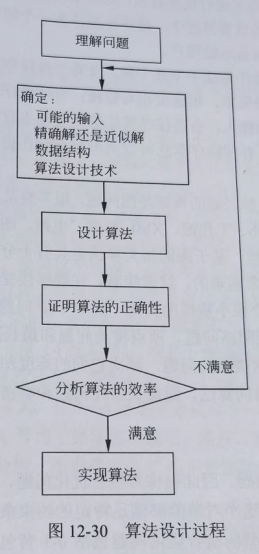
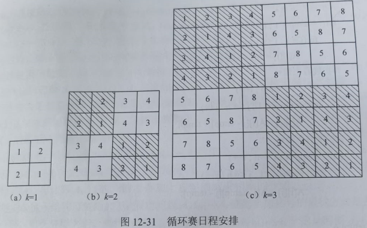
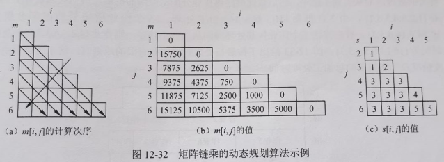
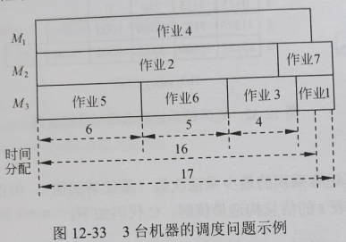

- 正如第8章提到的，算法理论的研究主要包括算法设计技术和算法分析技术，这两者是不可分割的一个整体。算法设计要提出针对问题的高质量的算法，算法分析的对象是被提出的算法，并研究算法所耗费的计算资源与问题规模之间的函数关系，而每一个被设计出的算法只有经过算法分析才能评价其质量的优劣。
- 因此，用什么方法来设计算法，如何判定一个算法的优劣，所设计的算法需要占用多少时间资源和空间资源，在实现一个软件系统时都是必须予以解决的重要问题。
- ## 算法设计过程
	- 在设计算法时，有几个问题是要考虑到的：如何设计算法？如何表示算法？如何证明问题解决的正确性？如何评估算法的效率？如何进行算法的最优化？根据这些问题，可以归纳出算法设计的主要步骤：
	  > 1. 理解问题；
	  > 2. 确定相关因素，包括问题的输入与输出、用何种数据结构、用什么样的算法设计策略等；
	  > 3. 设计算法；
	  > 4. 证明所设计的算法的正确性；
	  > 5. 分析所设计的算法的效率；
	  > 6. 实现所设计的算法。
	- ### 1. 理解问题
	  collapsed:: true
		- 在面对一个算法任务时，算法设计者往往不能准确地理解要求他做的是什么。对算法希望实现什么只有一个大致的想法就匆忙地落笔写算法，其后果往往是写出的算法漏洞百出。在设计算法时需要做的第一件事就是完全理解要解决的问题，仔细阅读问题的描述，手工处理一些小例子。
		- 对于设计算法来说，这是一项重要的技能。准确地理解算法的输入是什么？要求算法做的是什么？即明确算法的的入口和出口，这是设计算法的切入点。
	- ### 2. 确定相关因素
	  collapsed:: true
		- #### 2.1 预测所有可能的输入
			- 算法的输入确定了该算法所解问题的一个实例。一般而言，对于问题P，总有其相应的实例集I，因此算法A若是问题P的算法，则意味着把P的任一实例 input \in I 作为算法A的输入，都能得到问题P的正确输出。
			- 预测算法所有可能的输入，包括合法的输入和非法的输入，事实上，无法保证一个算法（或程序）永远不会遇到一个错误的输入，一个对大部分输入都运行正确而只有一个输入不行的算法，就像是一颗等待爆炸的炸弹。这绝不是危言耸听，有大量这种引起灾难性后果的案例。例如，许多年以前，整个AT&T的长途电话网崩溃，造成了几十亿美元的直接经济损失。原因只是一段程序的设计者认为他的代码能一起传送正确的参数值，可是有一天，一个不应该有的值作为参数传递了，导致了整个北美电话系统的崩溃。
			- 如果养成习惯——首先考虑问题和它的数据，然后列举出算法必须处理的所有特殊情况，那么可以更快速地成功构造算法。
		- #### 2.2 在精确解和近似解间做选择
			- 计算机科学的研究目标是用计算机来求解人类所面临的各种问题。但是，有些问题无法求得精确解，例如求平方根、解非线性方程和求定积分等。有些问题由于其固有的复杂性，求精确解需要花费太长的时间，其中最著名的要算旅行商问题（TSP问题），此时，只能求出挖解。
			- 有时需要根据问题以及问题所受的资源限制，在精确解和近似解间做选择。
		- #### 2.3 确定适当的数据结构
			- 在结构化程序设计时代，著名的计算机学者沃思（Wirth）提出了“==算法+数据结构=程序==”的观点，断言了算法和数据结构是构成计算机程序的重要基础。在面向对象的程序设计时代，数据结构对于算法设计和分析仍然是至关重要的。
			- 确定数据结构通常包括对问题实例的数据进行组织和重构，以及为完成算法所设计的辅助数据结构。在很多情况下，数据结构的设计直接影响基于该结构之上设计的算法的时间性能。
		- #### 2.4 确定算法设计技术
			- 第9章介绍的算法设计技术（或称为算法设计策略）是设计算法的一般性方法，可用于解决不同计算领域的多种问题。这些算法设计技术包括分治法、动态规划法、贪心算法、回溯法、分支界限法、概率算法和近似算法等，已经被证明是对算法设计非常有用的通用技术，它们构成了一组强有力的工具，在为新问题设计算法时，可以运用这些技术设计出新的算法。算法设计技术作为问题求解的一般性策略，在解决计算机领域以外的问题时，也能发挥相当大的作用。
	- ### 3. 设计算法
	  collapsed:: true
		- 根据1）和2）的结果，就可以设计算法。在构思和设计了一个算法之后，必须清楚、准确地将所设计的求解步骤记录下来，即描述算法。描述算法的常用方法有自然语言、流程图、程序设计语言和伪代码等，其中，伪代码是比较合适的描述算法的方法。
	- ### 4. 证明算法的正确性
	  collapsed:: true
		- 可以用循环不变式来证明算法的正确性，以插入排序为例介绍循环不变式，以下是插入排序的C代码。
		- ```c
		  #include <stdio.h>
		  void Insertion_Sort(int A[], int length) {
		    int index;
		    for(index = 1; index < length; index++) {
		      int temp = A[index];
		      if(A[index] < A[index = 1]) {
		        /* 因为 A[0..index-1]有序，若 A[index] < A[index-1]，
		  		则该元素应插入 index 之前的某个位置 */
		        int insert;
		        for(insert = index-1; insert>=0 && A[insert]>temp; insert--) {
		          /* 从 index-1 向前遍历，遇到小于temp的元素时停止 */
		          A[insert + 1] = A[insert];
		        }
		        A[insert + 1] = temp;
		      }
		    }
		  }
		  ```
		- 对于要分析的算法，定义循环不变式，如对插入排序，定义其外层循环的循环不变式为：在每一轮迭代的开始，子数组A[1..j-1]中包含了最初位于A[1..j-1]，但目前已经排好序的各个元素，然后证明循环不变式的3个性质。
			- > 1. ==初始化==。在循环的第一轮迭代开始之前它是正确的。对于插入排序，第一轮迭代之前，j=2，子数组为A[1..j-1]，即A[1]，也就是最初在A[1]中的那个元素，显然这个子数据是已安排好序的，因此循环不变式成立。
			  > 2. ==保持==。如果在循环的每一次迭代之前它是正确的，那么在下一次迭代之前，它也应该保持正确。对于插入排序（上述伪代码包含两重循环，应该定义两个循环不变式，并证明它们的正确性。但为了简便，暂时不陷入过于形式化的细节，仅考虑外层循环），要将A[j-1]、A[j-2]和A[j-3]等元素向右移一个位置，直到找到A[j]的适当位置为止，这里将A[j]的值插入。很显然，循环不变式是成立的。
			  > 3. ==终止==。当循环结束时，循环不变式给了我们一个有用的性质，它有助于表明算法是正确的。对于插入排序，当j大于n时，外层for循环结束。在循环不变式中，将j替换为n+1，就有子数组A[1..n]包含了原先在A[1..n]中的元素，但现在已经排好序了，这意味着算法是正确的。
		- 除了循环不变式外，经验和研究表明，发现算法（或程序）中逻辑错误的重要方法就是系统地跟踪算法。跟踪必须要用“心和手”来进行，跟踪者要像计算机一样，用一组输入值来执行该算法，并且这组输入值要最大可能地暴露算法中的错误。即使有几十年经验的高级软件工程师也经常利用此方法查找算法中的逻辑错误。
	- ### 5. 分析算法的效率
	  collapsed:: true
		- 设计出的算法只有经过分析，才能评价其优劣，才能判断其是否能满足问题求解的需求或者在多个算法之间进行选择。算法分析主要分析两种效率：时间效率和空间效率。时间效率显示了算法运行得有多快，空间效率则显示了算法需要多少额外的存储空间，相比而言，一般更关注算法的时间效率。事实上，计算机的所有应用问题，包括计算机自身的发展，都是围绕着“时间-速度”这样一个中心进行的。一般来说，一个好的算法首先应该是比同类算法的时间效率高。
	- ### 6. 根据算法编写代码
	  collapsed:: true
		- 现代计算机技术还不能将伪代码形式的算法直接“输入”进计算机中，而需要把算法转变为特定程序设计语言编写的程序，算法中的一条指令可能对应实际程序中的多条指令。在把算法转变为程序的过程中，虽然现代编译器提供了代码优化功能，但仍需要一些标准的技巧，例如，在循环体之外计算循环中的不变式、合并公共子表达式、用开销低的操作代替开销高的操作等。一般来说，这样的优化对算法速度的影响是一个常数因子，可能会使程序提高10%~50%的速度。
	- 算法设计的一般过程如图12-30所示。需要强调的是，一个好算法是反复努力和重复修正的结果。那么，什么时候应该停止这种改进呢？设计算法是一种工程行为，需要在资源有限的情况下，在互斥的目标之间进行权衡。设计者的时间显然也是一种资源，在实际应用中，常常是项目进度表迫使我们停止改进算法。
	- {:height 439, :width 204}
- ## 算法问题类型
	- 就像生物学家把自然界的所有生物作为自己的研究对象，计算机科学把问题作为自己的研究对象，研究如何用计算机来解决人类所面临的各种问题。在计算领域的无数问题中，或者由于问题本身具有一些重要特征，或者由于问题具有实用上的重要性，有一些领域的问题是算法研究人员特别关注的。经验证明，无论对于学习算法还是应用算法，对这些问题的研究都是极其重要的。下面列出几类重要的问题。
	- ### 查找问题
	  collapsed:: true
		- 查找是在一个数据集合中查找满足给定条件的记录。对于查找问题来说，没有一种算法对于任何情况都是合适的。有的算法查找速度比其他算法快，但却需要较多的存储空间（例如Hash查找）；有的算法查找速度非常快，但仅适用于有序数组（例如折半查找），等等。此外，如果在查找的过程中数据集合可能频繁地发生变化，除了考虑查找操作外，还需要考虑在数据集合中执行插入和删除等操作。这种情况下，就必须仔细地设计数据结构和算法，以便在各种操作的需求之间达到一个平衡。而且，组织用于高效查找的特大型数据集合对于实际应用具有非常重要的意义。
	- ### 排序问题
	  collapsed:: true
		- 简单地说，排序就是将一个记录的无序序列调整成为一个有序序列的过程。在对记录进行排序时，需要选定一个信息作为排序的依据，例如，可以按学生平均成绩对学生记录进行排序，这个特别选定的信息（平均成绩）称为关键码。
		- 排序的一个主要目的是为了进行快速查找，这就是为什么字典、电话簿和班级名册都是排好序的。当然，在很多领域的重要算法中，排序也被作为一个辅助步骤，例如，搜索引擎将搜索到的结果按相关程度排序后显示给用户。
		- 迄今为止，已经发现的排序算法不下几十种，没有一种排序算法在任何情况下都是最好的解决方案，有些排序算法比较简单，但速度相对较慢；有些排序算法速度较快，但却很复杂；有些排序算法适合随机排列的输入；有些排序算法更适合基本有序的初始排列；有些排序算法仅适合存储在内存中的序列；有些排序算法可以用来对存储在磁盘上的大型文件排序等。
	- ### 图问题
	  collapsed:: true
		- 算法中最古老也是最令人感兴趣的领域是图问题，很多纷乱复杂的现实问题抽象出的模型都是图结构，如社会网络、Web、工作流、XML数据、电路、图像、化合物和生物网络等。作为一种通用的、复杂的数据结构，基于图的相关算法也具有十分重要的作用。
		- 有些图问题在计算上是非常困难的，这意味着，在能够接受的时间内，即使用最快的计算机，也只能解决解决这种问题的一个很小规模的实例，例如TSP问题、最大团问题（即最大独立集问题）、图着色问题、哈密尔顿回路问题、顶点覆盖问题和最长路径问题等。图问题中还有一个奇怪的现象：许多形式上非常类似的问题，解决它们的难度却相差很大，例如，最短路径问题和欧拉回路问题存在多项式时间算法，而最长路径问题和哈密尔顿回路问题至今没有找到一个多项式时间算法。
	- ### 组合问题
	  collapsed:: true
		- 组合问题一般都是最优化问题，因此也称为组合优化问题，即寻找一个组合对象，例如一个排列、一个组合或一个子集，这个对象能够满足特定的约束条件并使得某个目标函数取得极值：价值最大或者成本最小。典型的组合优化问题包括0-1背包问题、TSP问题和整数线性规划等。
		- 无论从理论的观点还是实践的观点，组合问题都是计算领域中最难的问题，其原因职下。
		  > 1. 随着问题规模的增大，组合对象的数量增长极快，即使是中等规模的实例，其组合对象的数量也会达到不可思议的数量级，产生组合爆炸。
		  > 2. 还没有一种已知算法能在可接受的时间内精确地求解绝大多数问题。
	- ### 几何问题
	  collapsed:: true
		- 几何问题处理类似于点、线、面和体等几何对象。几何问题与其他问题的不同之处在于，哪怕是最简单、最初等的几何问题也难以用数字去处理。尽管人类对几何问题的研究从古代起便没有中断过，但是具体到借助计算机来解决几何问题的研究，还只是停留在一个初始阶段。随着计算机图形图像处理、机器人和断层X摄像技术等方面应用的深入，人们对几何算法产生了强烈的兴趣。经典的几何问题包括最近点对问题和凸包问题，前者指的是在给定平面上的n个点中，求距离最近的两个点；后者指的是要找出一个能把给定集合中的所有点都包含在里面的最小凸多边形。
- ## 典型实例
	- 下面给出一些典型的问题，并用常用的算法设计技术来设计算法，求解问题。
	- ### 循环赛日程安排问题
	  collapsed:: true
		- 设有 \( n(2^k) \) 位选手参加网球循环赛，循环赛共进行 n-1 天，每位选手要与其他 n-1 位选手赛一场，且每位选手每天赛一场，不轮空。试按此要求为比赛安排日程。
		- 该问题可以用分治法来求解。设n位选手被顺序编号为1，2，...，n。比赛的日程表是一个n行n-1列的表，第 i 行 j 列的内容是第 i 号选手第 j 天的比赛对手。用分治法设计日程表，就是从其中一半选手（ \( 2^{k-1} \) 位）的比赛日程导出全体（ \( 2^k \) 位）选手的比赛日程。从众所周知的只有两位选手的比赛日程出发，反复这个过程，直到为n位选手安排好比赛日程为止。
		- 为了从 \( 2^{k-1} \) 位选手的比赛日程表中导出 \( 2^k \) 位选手的比赛日程表，假定只有8位选手（如图12-31所示），若1~4号选手之间的比赛日程填在日程表的左上角（4行4列），5~8号选手之间的比赛日程填在日程表的左下角（4行4列），而左下角的内容可以由左上角对应项加上数4得到。至此，剩下的右上角（4行4列）是为编号小的1~4号选手与编号大的5~8号选手之间的比赛安排日程。例如在第4天，让1~4号选手分别与5~8号选手比赛，以后各天，依次由前一天的日程安排，让5~8号选手循环轮转即可。最后，参照右上角得到右下角的比赛日程，如图12-31所示。由以上分析，不难得到为 \( 2^k \)选手安排比赛的算法思路。
		- {:height 297, :width 464}
		- 循环赛日程安排算法的关键在于寻找这四部分元素之间的对应关系，其C代码如下：
		  ```c
		  int ** GameTable(int k) {
		    /* 为矩阵A分配空间，且不使用下标包含0的元素，即下标从1开始计算。矩阵A的第一列为选手的编号 */
		    int ** A = (int **)malloc(sizeof(int *)*((int)pow(2,k) + 1));
		    int i,j,t;
		    for(i=1; i<=(int)pow(2,k); i++) {
		      A[i] = (int *)malloc(sizeof(int)*((int)pow(2,k) + 1));
		    }
		    int n = 2;
		    A[1][1] = 1;
		    A[1][2] = 2;
		    A[2][1] = 2;
		    A[2][2] = 1;
		    for(t=1; t<k; t++) {
		      /* 以分治法填充日程表 */
		      int temp = n;
		      n *= 2;
		      /* 扩展左下角 */
		      for(i=temp+1; i<=n; i++)
		        for(j=1; j<=temp; j++)
		          A[i][j] = A[i-temp][j]+temp;
		      /* 扩展右上角 */
		      for(i=1; i<=temp; i++)
		        for(j=temp+1; j<=n; j++)
		          A[i][j] = A[i][j-temp] + temp;
		      /* 扩展右下角 */
		      for(i=temp+1; i<=n; j++)
		        for(j=temp+1; j<=n; j++)
		          A[i][j] = A[i-temp][j-temp];
		    }
		    return A;
		  }
		  ```
		- 其中，A为数组， \( n=2^k \) 表示参加比赛的人数。
	- ### 矩阵链乘问题
	  collapsed:: true
		- 给定n个矩阵 \( \{ A_1, A2, \cdots, A_n\} \)，其中，Ai 与 Ai+1 是可乘的，i=1、2、...、n-1，考虑这n个矩阵的乘积。由于矩阵乘法满足结合律，故计算矩阵的连乘积可以有许多不同的计算次序。这种计算次序可以用加括号的方式确定。若一个矩阵链乘的计算次序完全确定，这时就说该链乘已完全加括号。完全加括号的矩阵链乘可递归地定义为：
		  > 1. 单个矩阵是完全加括号的。
		  > 2. 矩阵链乘的乘积A是完全加括号的，则A可表示为两个完全加括号的矩阵链乘的乘积，B和C的乘积并加括号，即A=(BC)。
		- 例如，矩阵链乘 A1A2A3A4 可以有以下5种完全加括号的方式：(A1(A2(A3A4)))、(A1((A2A3)A4))、((A1A2)(A3A4))、(((A1A2)A3)A4)。每一种加括号的方式确定了一个计算的次序。不同的计算次序与矩阵链乘的计算量有密切关系。
		- 为了说明该问题，回忆两个矩阵相乘的相关概念。矩阵A和矩阵B可乘的条件是矩阵A的列数等于矩阵B的行数，若A是一个 p X q 矩阵，B是一个 q X r 矩阵，则其乘积 C=AB 是一个 p X r 矩阵，且标准的两个矩阵相乘所需要的计算量为 pqr 次乘法操作。
		- 考虑3个矩阵 {A1, A2, A3} 链乘的例子。设这3个矩阵的维数分别为 10  X 100、100 X 5 和 5 X 50。若按第一种加括号方式 ((A1A2)A3) 计算，则所需要的乘法次数为 10 X 100 X 5 + 10 X 5 X 50=7500。若按第二种加括号方式 (A1(A2A3)) 计算，则所需要的乘法次数为 10 X 5 X 50 + 10 X 100 X 50=75000。第二种加括号方式乘法次数是第一种的10倍。由此可以看出，不同的加括号方式确定的不同的计算次序对矩阵链乘的运算量影响是巨大的。
		- 矩阵链乘问题定义如下：给定n个矩阵 {A1,A2,...,An}，矩阵Ai的维数为 pi-1 X pi，i=1、2、...、n，如何给矩阵链乘 A1 X A2 X ...XAn完全加上括号，使得矩阵链乘中乘法次数最少。
		- 矩阵链乘是非常难的问题，若用穷尽搜索法，能够证明需要指数时间来求解。现在考虑用动态规划法来求解矩阵链乘问题，具体步骤如下。
			- 1. ==刻画矩阵链乘问题的结构==。
				- 为简便起见，用 \( A_{i..j}\) 表示矩阵乘积 \(A_i A_{i+1}\cdots A_j\) 的结果，其中 \( i\le j\)。若问题是非平凡的，即 i<j，那么乘积 \(A_i A_{i+1}\cdots A_j\) 一定在 \(A_k\)与 \(A_{k+1}\) 之间被分裂， \(i \le k \lt j \)。问题 \(A_i A_{i+1}\cdots A_j\) 完全加括号的开销等于计算矩阵 \(A_{i..k}\) 与计算 \( A_{k+1..j}\) 的开销，再加上它们的结果相乘的开销。
				- 问题的最优子结构可刻画如下：假定问题 \(A_i A_{i+1}\cdots A_j\)被完全加括号的最优方式是在 \(A_k\) 与 \(A_{k+1}\) 之间被分裂，那么分裂之后，最优解 \(A_i A_{i+1}\cdots A_j\) 中的子链 \(A_i A_{i+1}\cdots A_k\)一定是问题 \(A_i A_{i+1}\cdots A_k\)的最优加括号方式。同样，最优解 \(A_{k+1}A_{k+2}\cdots A_j\) 中的子链一定是问题 \(A_{k+1}A_{k+2}\cdots Aj \) 的最优加括号方式。
			- 2. ==递归定义最优解的值==。
				- 根据问题的最优解递归地定义问题最优解的开销。设 m[i,j] 表示计算 \( A_{i..j} \) 所需的最小乘法次数，得到下列递归式。对于原问题，计算 \( A_{1..n} \) 的最小开销则为 m[1,n]。
				  $$
				  m[i,j] =
				  \begin{cases}
				  0 & ,i = j \\
				  \underset{i\le k \lt j}{\min} \{ m[i,k] + m[k+1,j] + p_{i-1}p_k p_j \} & ,i \lt j
				  \end{cases}
				  $$
			- 3. ==计算最优解的值==。
				- 根据上述递归式，以自底向上的方式计算最优开销。假设输入为 \( p = \langle p_0,p_1,\cdots,p_n \rangle \)，用表 m[1..n,1..n] 存储 m[i,j]，用辅助表 s[1..n,1..n] 存储哪一个 k 使得计算 m[i,j] 时达到最优。最终需要利用 s 构造问题的一个最优解。算法的C代码如下：
				- ```c
				  int** Matrix_Chain_Order(int* p, int Length) {
				    int Multip_times = Length - 1;
				    /* 为 m、s分配空间 */
				    int** m = (int **)malloc(sizeof(int *) * (Length));
				    int** s = (int **)malloc(sizeof(int *) * (Length));
				    int i;
				    for(i=0; i<Length; i++) {
				      m[i] = (int *)malloc(sizeof(int) * (Length));
				      s[i] = (int *)malloc(sizeof(int) * (Length));
				    }
				    /* 初始化 */
				    for(i=1; i<= Multip_times; i++)
				      m[i][i] = 0;
				    int l;
				    /* 自底至上计算 m、s */
				    for(l=2; l<= Multip_times; l++) { /* l为子问题长度，即有l个矩阵相乘 */
				      for(i=1; i <= (Multip_times-l+1); i++) {
				        int q = m[i][k] + m[k+1][j] + p[i-1] * p[k] * p[j];
				        if (q < m[i][j]) { /* 当前代价小于之前的最小代价 */
				          m[i][j] = q;
				          s[i][j] = k;
				        }
				      }
				    }
				    return s;
				  }
				  ```
				- 由上述伪代码很容易得到算法的时间复杂度为 \( O(n^3) \) 。举个例子说明上述过程，假设 n=6， \( p = \langle p_0, p_1, \cdots, p_6 \rangle = \langle 30,35,15,5,10,20,25 \rangle \)。则根据上述伪代码，图12-32给出了 m[i,j] 的计算次序以及 m[i,j] 和 s[i,j] 的值。
				- {:height 220, :width 587}
			- 4. ==构造最优解==。
				- 上一步给出了计算矩阵乘积的最少乘法次数（最优解的值），但没有给出具体的乘法次序（最优解）。可以由辅助表 s 的信息构造最优解，C代码如下。
				- ```c
				  void Print_Optimal_parens(int **s, int i, int j) { /* 表项 s[i,j]记录了对乘积 AiAi+1...Aj 在 Ak 和 Ak+1 之间进行分裂，以取得最优加全部括号时的k值 */
				    if (i == j)
				      printf("A%d",i);
				    else {
				      printf("(");
				    	Print_Optimal_Parens(s,i,s[i][j]); /* 在当前分裂左侧继续分裂 */
				      Print_Optimal_Parens(s,s[i][j]+1,j); /* 在当前分裂右侧继续分裂 */
				      printf(")");
				    }
				  }
				  ```
				- 上述例子调用 OutputOptimalParens(s,1,6) 后得到输出结果 `((A1(A2A3))((A4A5)A6))`。
	- ### 多机调度问题
		- 假设有n个独立的作业 {1,2,...,n}，由m台相同的机器 {M1,M2,...,Mm} 进行加工处理，作业 i 所需的处理时间为 ti，每个作业均可在任意一台机器上加工处理，但不可间断或拆分，即一旦一个作业在某台机器上加工处理，便不会再转移到其他的机器上。多机调度问题要求给出一种作业调度方案，使所给的n个作业在尽可能短的时间内由m台机器加工处理完成。
		- 多机调度问题是NP难问题，到目前还没有有效的算法。对于这类问题，用贪心算法求解有时可以得到较好的近似解。贪心法求解多机调度问题时的贪心策略是最长处理时间优先。当 m>= n时，只要将机器 i 上的 [0,ti] 时间区间分配给作业 i 即可；当 m < n时，首先将 n 个作业按其所需的处理时间从大到小排序，然后依此顺序将作业分配给空闲的机器。例如，假设有7个作业 {1,2,3,4,5,6,7}，由3台机器 {M1,M2,M3} 加工处理，各个作业所需要的时间分别为 {2,14,4,16,6,5,3} 。首先将这7个作业按其处理时间从大到小排序，则作业 {4,2,5,6,3,7,1} 的处理时间为 {16,14,6,5,4,3,2}。图12-33给出了按最大处理时间作业有限的原则时，这7个作业的调度情况及其所需要的总加工处理时间。
		- {:height 238, :width 333}
		- 假设对n个作业按其加工处理时间从大到小进行了排序，排序的时间复杂度为 O(nlgn)。下面给出用贪心法解决多机调度问题的C代码。
		- ```c
		  typedef struct {
		    int ID;
		    int time;
		  }Task;
		  int IndexOfMin(int *Array, int Number) {
		    int i;
		    int index = 0;
		    int min = Array[0];
		    for(i=1; i<Number; i++) {
		      if(Array[i] < min) {
		        index = i;
		        min = Array[i];
		      }
		    }
		    return index;
		  }
		  
		  int* MultiMachineSchedule(Task *Tasks, int Task_number, int Machine_number) {
		    /* Finish_times 数组为每台机器完成作业的累积时间 */
		    /* Task_lists数组为每台机器完成作业的列表，如第一台机器依次完成作业1、2、3，则其数组元素为123 */
		    int* Finish_times = (int *)malloc(sizeof(int) * (Machine_number));
		    int* Task_lists = (int *)malloc(sizeof(int) * (Machine_number));
		    int i;
		    for(i=0; i<Machine_number; i++) {
		      /* 初始化数组 */
		      Finish_times[i] = 0;
		      Task_lists[i] = 0;
		    }
		    for(i=0; i<Machine_number; i++) {
		      /* 先让Machine_number台机器处理排名前Machine_number的作业 */
		      Task_lists[i] = Task_lists[i] * 10 + Tasks[i].ID;
		      Finish_times[i] += Tasks[i].time;
		    }
		    for(; i<Task_number; i++) {
		      /* 选择最早完成作业的机器处理未完成作业中所需时间最长的作业 */
		      int index = IndexOfMin(Finish_times, Machine_number); // 选出最先完成任务的机器
		      Task_lists[index] = Task_lists[index] * 10 + Tasks[i].ID;
		      Finish_times[index] += Tasks[i].time;
		    }
		    return Task_lists;
		  }
		  ```