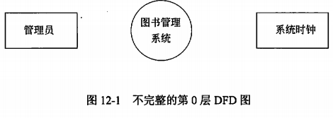
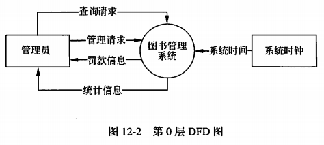
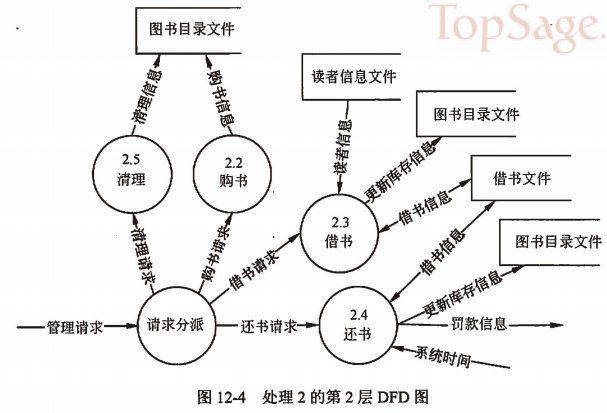

alias:: 结构化分析

- 结构化分析的最终结果需要得到系统的数据流图、数据字典和加工处理说明。根据需求说明，首先办公室系统的边界。因为购入新书、读者借书、读者还书和图书注销将来都是由图书管理员来操作系统，因此图书管理员将是系统的外部实体之一。当读者借书超期时，系统会给读者一个罚款单信息，所以，这里可以将系统时钟和读者也作为系统的外部实体之一。当然，如果认为罚款单是由系统管理转交给读者，则可以认为图书管理系统只和管理员与系统时钟进行交互，这里采用第二种观点。咨询要求同样都是由系统管理员来操作，由此可以得出系统不完整的第0层DFD数据流图如图12-1所示。
  {:height 139, :width 404}
- 在0层DFD图上分析外部实体与系统间的数据流，因为管理员的两大工作任务是分析管理任务和咨询任务，因此管理员会向系统输入管理请求信息与查询请求信息，根据输入的管理请求，系统将会对一些存储文件进行修改；对查询请求，系统则会给出读者、图书与借阅的统计信息。系统时钟主要为图书管理系统提供系统时间。为图12-1补充数据流所得完整的0层DFD数据流图12-2所示。
  {:height 192, :width 410}
- 随后对0层DFD数据流图中的图书管理系统进行进一步细化，根据需求可以得知，系统主要分为管理任务和查询任务，因此可以将其细化为两个大的处理，如图12-3所示。
  
- 同样，对处理2进行进一步细化，管理处理分为购书、借书、还书和清理4项任务，因此可以将处理2分解为4个处理，另外需要一个单独的处理根据管理请求的类型进行请求分派。细化后的数据流图如图12-4所示。
  {:height 374, :width 547}
- 同样的方法，可以对处理1也进行细化。一旦对处理1的细化完成，即可对得到的数据流图进行转化，从而形成系统的总体设计。但在转换之前，应该对数据流图中的数据流采用数据字典进行详细进行详细的说明，例如：
- 管理请求=清理请求|购书请求|借书请求|还书请求
- 清理请求=图书分类目录号
- …
- 对于底层处理，以处理2.3为例进行说明。
  加工编号：2.3
  加工名称：借书
  输入流：读者信息，借书信息
  输出流：借书信息
  处理逻辑：根据读者信息和借书信息，首先判断读者是否合法，判断读者是否已经超出借阅图书数目的最大限制，若都合法，将借书信息重新写入借书文件中，同时更新图书目录文件。