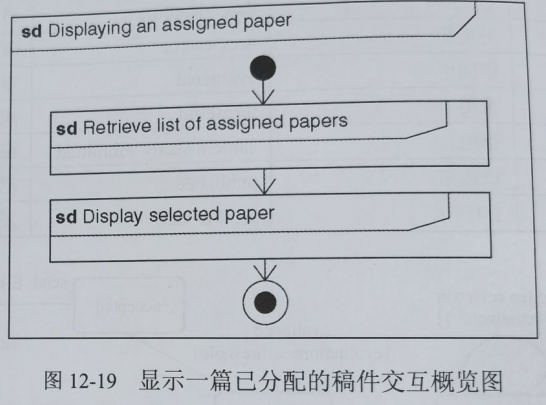
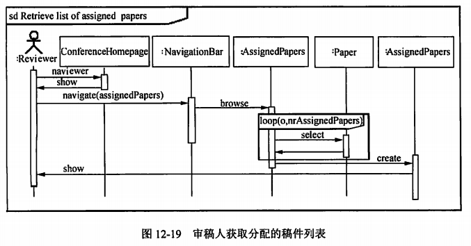

filters:: {"索引" false}
title:: 软件系统分析与设计/面向对象分析与设计/建模交互
alias:: 建模交互

- **交互概览图** 是活动图的变体，描述业务过程中的控制流概览，软件过程中的详细逻辑概览，以及将多个图进行连接，抽象掉了消息和生命线。审稿系统中显示一篇已分配的稿件（Displaying as assigned paper），首先需获取（Retrieve list of assigned papers），然后再显示（Display selected paper），如图12-19所示。
	- {:height 292, :width 389}
- **序列图** 是以图形化的方式描述了在一个用例或操作的执行过程中对象如何通过消息互相交互，说明了消息在对象之间被发送和接收以及发送的顺序。根据分析设计的迭代演化需求，最初可以绘制系统序列图。系统序列图是一副描述角色和系统在用例场景下交互的图形，有助于确定进入和退出系统的高层信息。
- 审稿人获取已分配给自己的稿件的执行序列，浏览会议主页，看到主页后，从导航条浏览已分配给自己的稿件，可循环进行选择，创建已分配稿件并显示给审稿人。得出图12-19所示的审稿人获取分配给自己的稿件列表。
	- 
- 建模序列图应该遵循以下指导原则。
  > 1. 确定序列图的范围，描述这个用例场景或一个步骤。
  > 2. 如果范围包括参与者和接口，则绘制参与者和接口类。
  > 3. 沿左手边列出用例步骤。
  > 4. 对==控制器类==及必须在序列中协作的每个实体类，基于它拥有的属性或已经分配给它的行为绘制框。
  > 5. 为==持久类==和==系统类==绘制框。
  > 6. 绘制所需消息，并把每条消息指到将实现响应消息的责任的类上。
  > 7. 添加活动条指示每个对象实例的生命期。
  > 8. 为清晰起见，添加所需的返回消息。
  > 9. 如果需要，为循环、可选步骤和替代步骤等添加框架。