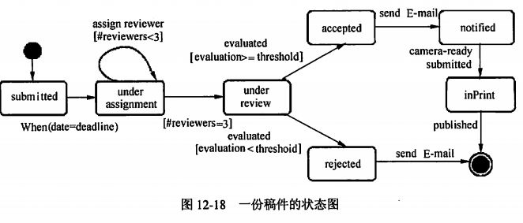

alias:: 建模对象状态

- 对象状态表示对象在其生命期中某一点所处的条件，通过修改对象属性的一个或多个值的事件触发对象状态变化。状态图用于建模在生命周期中事件如何改变对象可以经历的各种状态，以及引起对象从一个状态向另一个状态转换的事件。
- 基于需求描述中的信息，稿件上传成功之后，成为已上传状态。上传稿件的最后期限到了之后，就进入分配中，当分配给审稿人的数量达到规定的三个之后，进入审阅中，审阅结束后，评估结果如果大于等于设定的阈值，则变为录用状态，然后发送E-mail之后，变为已通知，当提交完准备好印制的电子版时，进入打印中，出版之后，状态结束；如果评估结果小于设定的阈值，变为解决状态，发送给作者E-mail通知状态结束。根据分析得到图12-18所示的一份稿件的状态图。
  
- 建模状态图时应该注意遵循如下指导原则。
  > 1. 状态名称要简单但具有描述性。
  > 2. 避免“黑洞”状态，即只有变换进来而没有任何转换发出的状态，这种状态要么由于该状态是一个最终状态，要么就是已经错过了一个或多个转换。
  > 3. 避免“奇迹”状态，即只有转换发出而没有任何转换进来的状态，这种状态要么是一个起点，要么就是已经错过了一个或多个转换。
  > 4. 对符合状态，需要对子状态集进行建模。
  > 5. 为复杂的实体创建分层的状态图。