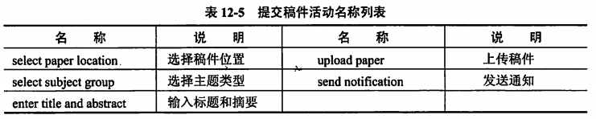
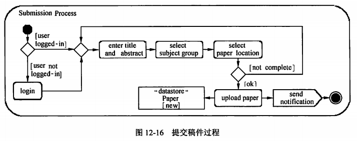

alias:: 建模活动

- 用例建模完成后，对每个用例进行细化，建模活动图。活动图描述一个业务过程或者一个用例的活动的顺序，也可以用于系统的建模逻辑。在此以用例提交稿件（submit paper）为例，建模其活动。
- 根据需求描述，提交稿件过程识别出表12-5所示的活动。
	- 
- 因为从建模用例图时可知，参与者、作者和用户之间存在继承关系，提交稿件和登录之间存在扩展关系，提交稿件必须是在登录之后进行，所以，提交稿件的过程中首先判断用户是否登录，如果登录则继续；如果没有登录，则执行登录活动。根据活动说明，建模出图12-16所示的活动图。
	- 
- 活动图并不同于流程图，它提供了描述并行活动的机制，特别适合于建模操作正在执行时的活动以及那些活动的结果。建模活动图时应该遵循以下指导原则。
	- > 1. 根据分析决定是否采用泳道。
	  > 2. 从一个作为起点的初始节点开始。
	  > 3. 为用例的每个主要步骤（或者一个角色发起的每个主要步骤）添加一个动作。
	  > 4. 从一个动作到另一个动作、决策点或者终点添加一条流。除分支、合并、分岔和汇合外，每个动作应该只有一个输入流和一个输出流。
	  > 5. 在流分解成不同的路线的地方添加分支，确保用一个合并将各个流重新合并。
	  > 6. 在并行执行活动的地方添加分支和汇合。
	  > 7. 用一个活动终止符号结束。