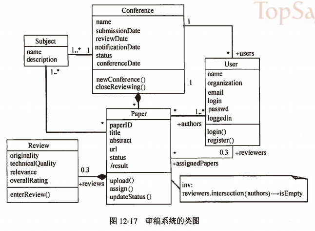

filters:: {"索引" false}
title:: 软件系统分析与设计/面向对象分析与设计/设计类图
alias:: 设计类图

- 类图用于描述系统的对象结构，它们显示了构成系统的对象类及其之间的关系。根据需求描述识别出对象类型有会议、用户、会议主题、稿件和审阅意见。
	- > 1. ==会议==。“会议有名称、涵盖的主题（包括名称和描述）、提交期限、审稿期限、通知日期、状态和会议召开日期等信息。创建一个新的会议后审稿系统启动，在审稿结束时关闭审稿过程。”所得到会议的属性有名称、提交期限、审稿期限、通知日期、状态和会议召开日期；行为有创建会议和关闭审稿过程。
	  > 2. ==用户==。“需要提供名称、单位、电子邮件、登录名、密码、登录的状态。”因此，得到用户的属性有名称、单位、电子邮件、登录名、密码、登录的状态；行为有登录和注册。
	  > 3. ==会议主题==。会议涵盖的主题包括名称和描述，所以属性为名称和描述。
	  > 4. ==稿件==。上传稿件的过程中需要输入标题和摘要、类型、URL、状态已经审阅后的结果，并在系统内有唯一标识，所以稿件的属性有稿件ID、标题、摘要、URL和录用标准；行为有上传、分配和更新状态。
	  > 5. ==审阅意见==。审稿人对稿件进行审阅时，从原创性、技术质量、相关性和总体评价多个方面录入审阅意见。所以，审阅意见的属性有原创性、技术质量、相关性和总体评价；行为有输入审阅意见。
- 对于每个类型之间，确定其对象/类关系、多重度以及角色名称，例如会议和稿件之间的关系是聚合关系，一个会议有很多稿件，用户分为普通用户user、author和reviewer有一种角色，并对其中的约束条件加以说明，某一稿件的审阅人不可以是本稿件的作者：reviewer.intersection(authors)->isEmpty，得到图12-17所示审稿系统的类图。
	- 
- Lenat和Guha建议，如果一个概念满足以下几点就应该抽象为一个类。
  > 1. 几个有趣的事务，它们可以作为一个整体被描述为这个概念。
  > 2. 它具有不与任何其他的类共享的属性。
  > 3. 这个概念的声明能将这个类及其所从属的某个较大的类相区别。
  > 4. 这个概念的边界是不精确的。
  > 5. “兄弟”（如辅助类，这些辅助类的联合是该类的自然泛化）数目是少的。
- TODO 实体类、边界类、抽象类、存储类