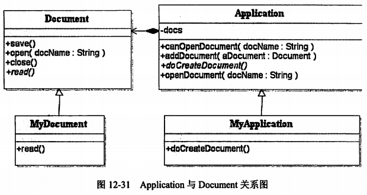
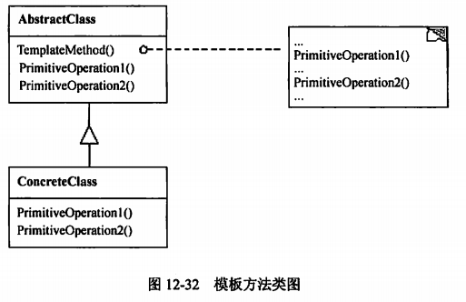

title:: 软件系统分析与设计/面向对象的程序设计与实现/设计模式的应用
alias:: 设计模式的应用

- ## 1. 问题说明
	- 已知某类库开发商提供了一套类库，类库中定义了Application类和Document类，它们之间的关系如图12-31所示，其中，Application类表示应用程序自身，而Document类则表示应用程序打开的文档。Application类负责打开一个已有的以外部形式存储的文档，如一个文件，一旦从该文件中读出信息后，它就由一个Document对象表示。
	  {:height 277, :width 514}
	- 当开发一个具体的应用程序时，开发者需要分别创建自己的Application和Document子类，例如图12-31中的类MyApplication和类MyDocument，并分别实现Application和Document类中的某些方法。
	- 已知Application类中的openDocument方法采用了模板方法（Template Method）设计模式，该方法定义了打开文档的每一个主要步骤，如下所示。
	  > 1. 首先检查文档是否能够被打开，若不能打开，则给出出错信息并返回。
	  > 2. 创建文档对象。
	  > 3. 通过文档对象打开文档。
	  > 4. 通过文档对象读取文档信息。
	  > 5. 将文档对象加入到Application的文档对象集合中。
- ## 2. 根据设计模式的名称画出其对应的类图
	- 问题描述中已经给出了该设计采用的设计模式为模板方法，因此，首先给出模板方法的类图，如图12-32所示。
	- {:height 262, :width 401}
- ## 3. 理解类图中每一个类的作用与功能
	- 模板方法类图中，AbstractClass类定义了基本的操作PrimitiveOperation1()和PrimitiveOperation2()，并在TemplateMethod()方法中调用了这两个操作，但这两个操作都并未实现，而是留待子类去实现，从而达到模板方法的目的：定义一个操作中的算法的骨架，而将一些步骤延迟到子类中，使得子类可以不改变一个算法的结构即可重定义该算法的某些特定步骤。
- ## 4. 能够将现实问题中所描述的各种职责映射到类图中具体的类
	- 在提出的具体问题中，已经告知了Application类中的openDocument方法采用了模板方法，而openDocument方法的步骤都已经给出，因此，很容易将Applicaiton类对应为模板方法类图中的AbstractClass类，openDocument方法映射为模板方法类图中的TemplateMethod方法，而主要步骤则对应为PrimitiveOperation1()等基本操作。由此可推出，在各种主要的步骤中，应该存在某些步骤是由Application的子类实现的。
- ## 5. 能够使用一种面向对象语言实现设计
	- 一旦分析清楚实际问题的设计结果和原始的设计模式类图中类的对应关系，便可采用一种面向对象语言实现。下面分别采用C++和Java语言实现给出的设计。
	- 【C++】代码
	- ```c++
	  #include <iostream>
	  #include <vector>
	  using namespace std;
	  class Document {
	    public:
	      void save() {}
	      void open(string docName) {}
	      void close() {}
	      virtual void read(string docName) = 0;
	  };
	  class Application {
	    private:
	    	vector <Document*> docs;
	  
	    public:
	      bool canOpenDocument(string docName) {
	        /**
	         * 判断是否可以打开指定文档，返回真值表示可以打开，返回假值表示不可以打开，此处代码省略
	         */
	      }
	    	void addDocument(Document* aDocument) {
	        /* 将文档对象添加到文档对象集合中 */
	        docs.push_back(aDocument);
	      }
	  	virtual Document* doCreateDocument() = 0;
	      void openDocument(string docName) {
	        if (!canOpenDocument(docName)) {
	          cout << "文档无法打开！" << endl;
	          return;
	        }
	        Document* adoc = doCreateDocument();
	        adoc->open(docName);
	        adoc->read(docName);
	        addDocument(adoc);
	  	}
	  };
	  ```
	- 【Java】代码
	- ```java
	  abstract class Document {
	    public void save() {}
	    public void open(String docName) {}
	    public void close() {}
	    public abstract void read(String docName);
	  }
	  abstract class Application {
	    private Vector<Document> docs;
	  
	    public boolean canOpenDocument(String docName) {}
	    public void addDocument(Document aDocument) {
	      docs.add(aDocument);
	    }
	    public abstract Document doCreateDocument();
	    public void openDocument(String docName) {
	      if (!canOpenDocument(docName)) {
	        System.out.println("文档无法打开！");
	        return;
	      }
	      Document adoc = doCreateDocument();
	      adoc.open(docName);
	      adoc.read(docName);
	      addDocument(adoc);
	    }
	  }
	  ```