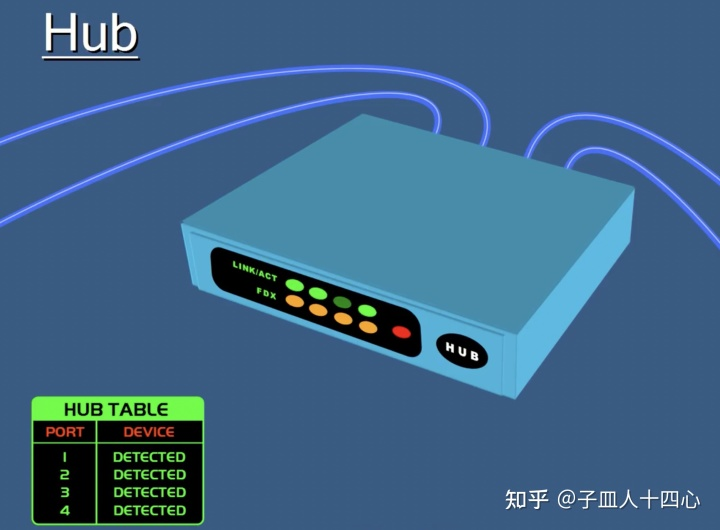
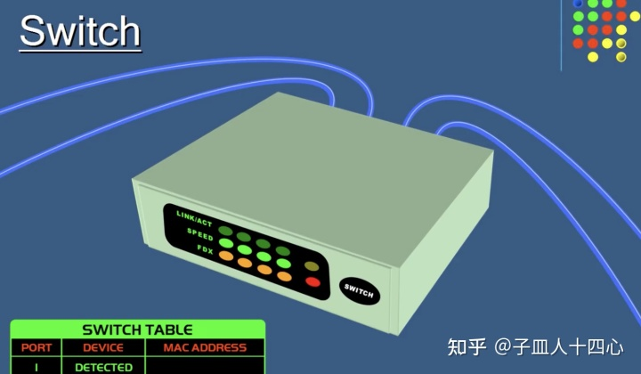
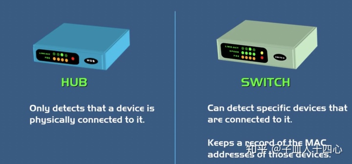
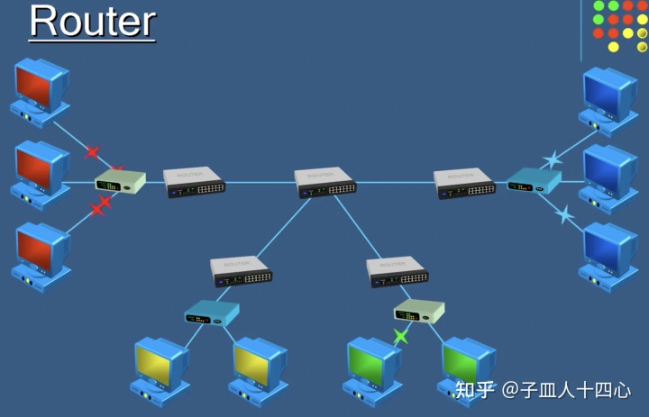

- ## 集线器 Hub
	- {:height 310, :width 414}
	- 集线器的目的是将内部网络上所有网络设备连接在一起。它具有多个端口，可以接受来自网络设备的以太网连接。集线器不过滤任何数据、也不知道该将数据发到什么地方。集线器唯一知道的是设备何时连接到其端口之一。因此，当数据包到达端口之一时，它将被复制到所有其他端口。因此，集线器上所有设备都可以看到数据包。数据包进入一个端口，然后集线器通过连接的设备将数据重新广播到每个端口。
	- 因此，即使计算机A只想和计算机B通信。其他计算机仍将接收数据。这不仅会引起安全问题，还会造成不必要的网络流量从而浪费带宽。
- ## 交换器 Switch
	- {:height 253, :width 416}
	- 交换机与集线器很类似，不过更“聪明”一点。它可以识别已连接设备的物理地址，并将这些地址（称为Mac地址）存储在路由表中。因此，当数据包发送到交换机时，它们仅路由到预期的目标端口。这是交换机与集线器的主要区别。交换机更有优势、因为它们减少了网络上任何不必要的流量。
	- {:height 242, :width 509}
	- 集线器和交换机用于在本地网络内交换数据，比如在家庭网络或工作专用网络中。它们不用于在自己的网络之外（Internet）共享数据。为了在网络之外共享数据，设备需要能够读取IP地址、这也是路由器大显身手之处。
- ## 路由器 Router
	- {:height 331, :width 504}
	- 路由器正如其名，是根据设备IP地址、从一个网络到另一个网络路由/重定向数据的设备。当接收到一个数据包时，路由器会检查数据的IP地址，并确定该数据包是用于其自己网络还是其他网络。
	- 如果路由器确定该数据包用于其自己网络，它将接收该数据包；如果不是，它将将数据包发送给其他网络。所以路由器是一个网络网关。
	- 假设红色网络中的一台计算机要与蓝色网络计算机通讯。数据包必须离开其网络并转到Internet。数据包将依次经过三个路由器到达蓝色网络，这就是路由器的工作方式。