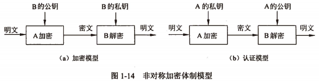

- {:height 153, :width 573}
- 非对称加密算法的保密性比较好，它消除了最终用户交换密钥的需要，但加密和解密花费时间长、速度慢，不适合于对文件加密，而只适用于对少量数据进行加密。
- ## RSA算法
	- RSA（Rivest，Shanmir and Adleman）算法是一种公钥加密算法，它按照下面的要求选择公钥和密钥。
	- > 1. 选择两个大素数p和q（大于$$10^{100}$$）
	  > 2. 令$$n = p \times q$$ 和 $$ z = (p - 1) \times (q - 1)$$
	  > 3. 选择 d 与 z 互质
	  > 4. 选择 e，使 $$e \times d = 1(\mod z)$$
	- > 明文被分成k位的块，k是满足 \(2^{k} < n\) 的最大整数，于是有 \(0 \le P < n\)。
	  加密时计算 \( C = P^{e}(\mod n) \) ，这样公钥为(e, n)。
	  解密时计算 \( P = C^{d}(\mod n) \) ，即私钥为(d, n)。
	- > 例如，设p=3, q=11, n=33, z=20, d=7, e=3, $$C = P^{3}(\mod 33)$$, $$P = C^{7}(\mod 33)$$，则有
	  \( C = 2^{3}(\mod 33) = 8(\mod 33) = 8 \)
	  \( P = 8^{7}(\mod 33) = 2097152(\mod 33) = 2 \)
	- > RSA算法的安全性是基于==大素数分解的困难性==。攻击者可以分解已知的n，得到p和q，然后可得到z，最后用 **Euclid算法**，由e和z得到d。但是要分解200位的数，需要40亿年；分解500位的数，则需要$$10^{25}$$年。