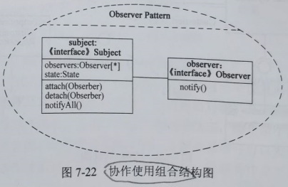

filters:: {"索引" false}
alias:: UML中的图

- 图（diagram）是一组元素的图形表示，大多数情况下把图画成顶点（代表事物）和弧（代表关系）的连通图。为了对系统进行可视化，可以从不同的角度画图，这样图是对系统的投影。
- UML2.0提供了13种图，分别是类图、对象图、用例图、序列图、通信图、状态图、活动图、构件图、部署图、组合结构图、包图、交互概览图和计时图。
  序列图、通信图、交互概览图和计时图均被称为交互图。
- TODO 结构性视图：对象图、包图、构件图、部署图、类图
- ## 类图
  collapsed:: true
	- 类图（class diagram）展现了一组对象、接口、协作和它们之间的关系。在面向对象系统的建模中所建立的最常见的图就是类图。类图给出系统的静态设计视图。包含主动类的类图给出了系统的静态进程视图。
	- 类图中通常包括下述内容（如图10-17所示）。
	  {:height 409, :width 497} 
	  > 1. 类。
	  > 2. 接口
	  > 3. 协作。
	  > 4. 依赖、泛化和关联关系。
	- 类图中也可以包含注解和约束。类图还可以含有包或子系统，二者都用于把模型元素聚集成更大的组块。
	- 类图用于对系统的静态设计视图建模。这种视图主要支持系统的的功能需求，即系统要提供给最终用户的服务。当对系统的静态设计视图建模时，通常以下述三种方式之一使用类图。
	  collapsed:: true
		- > 1. ==对系统的词汇建模==。对系统的词汇建模涉及到做出这样的决定：哪些抽象是考虑中的系统的一部分，哪些抽象处于系统边界之外。用类图详细描述这些抽象和它们的职责。
		  > 2. ==对简单的协作建模==。协作是一些共同工作的类、接口和其他元素的群体，该群体提供的一些合作行为强于所有这些元素的行为之和。例如，当对分布式系统的事务语义建模时，不能仅仅盯着一个单独的类来推断要发生什么，而要有相互协作的一组类来实现这些语义。用类图对这组类以及它们之间的关系进行可视化和详述。
		  > 3. ==对逻辑数据库模式建模==。将模式看作为数据库的概念设计的蓝图。在很多领域中，要在关系数据库或面向对象数据库中存储永久信息，可以用类图对这些数据库的模式建模。
- ## 对象图
  collapsed:: true
	- 对象图（object diagram）展现了某一时刻一组对象以及它们之间的关系。对象图描述了在类图所建立的事物的实例的静态快照。对象图一般包括对象和链。
	  {:height 285, :width 559}
	- 和类图一样，对象图给出系统的静态设计视图或静态进程视图，但它们是从真实的或原型实例的角度建立的。这种视图主要支持系统的功能需求，即系统应该提供给最终用户的服务。利用对象图可以对静态数据结构建模。
	- 当对系统的静态设计视图或静态进程视图建模时，主要是使用对象图对对象结构进行建模。对象结构建模涉及在给定时刻抓取系统中对象的快照。对象图表示了交互图表示的动态场景的一个静态画面。可以使用对象图可视化、详述、构造和文档化系统中存在的实例以及它们之间的相互关系。
- ## 用例图
	- 用例图（use case diagram）展现了一组用例、参与者（Actor）以及它们之间的关系。
	- 用例图通常包括如下内容（如图7-13所示）。
	  collapsed:: true
	  {:height 309, :width 538} 
	  ((6274c8ac-d9a0-42be-abcb-4cd2b8f02973)) ((6274c8ac-75c5-4dfe-80e3-8bce5ad3cef9))
		- > 1. 用例。
		  > 2. 参与者。
		  > 3. 用例之间的扩展关系（<<extend>>）和包含关系（<<include>>），参与者和用例之间的关联关系，用例与用例以及参与者与参与者之间的泛化关系。
	- 用例图用于对系统的静态用例视图进行建模。这个视图主要支持系统的行为，即该系统在它的周边环境的语境中所提供的外部可见服务。
	- 当对系统的静态用例视图建模时，可以用下列两种方式来使用用例图。
	  collapsed:: true
		- > 1. ==对系统的语境建模==。对一个系统的语境建模，包括围绕整个系统画一条线，并声明有哪些参与者位于系统之外并与系统进行交互。在这里，用例图说明了参与者以及他们所扮演的角色的含义。
		  > 2. ==对系统的需求建模==。对一个系统的需求进行建模，包括说明这个系统应该做什么（从系统外部的一个视点出发），而不考虑系统应该怎样做。在这里，用例图说明了系统想要的行为。通过这种方式，用例图使我们能够把整个系统看作一个黑盒子，采用矩形框表示系统边界；可以观察到系统外部有什么，系统怎样与哪些外部事物相互作用，但却看不到系统内部是如何工作的。
- ## 交互图
	- 交互图用于对系统的动态方面进行建模。一张交互图表现的是一个交互，由一组对象和它们之间的关系组成，包含它们之间可能传递的消息。交互图表现为序列图、通信图、交互概览图和计时图，每种针对不同的目的，能适用于不同的情况。
	  collapsed:: true
		- > 1. 序列图是强调消息时间顺序的交互图。
		  > 2. 通信图是强调接收和发送消息的对象的结构组织的交互图；
		  > 3. 交互概览图强调控制流的交互图。
	- 交互图用于对一个系统的动态方面建模。在多数情况下，它包括对类、接口、构件和结点的具体的或原型化的实例以及它们之间传递的消息进行建模，所有这些都位于一个表达行为的脚本的语境中。交互图可以单独使用，来可视化、详述、构造和文档化一个特定的对象群体的动态方面，也可以用来对一个用例的特定的控制流进行建模。
	- 交互图一般包含对象、链和消息。
	- ### 序列图
	  collapsed:: true
		- 序列图（sequence diagram）是场景（scenario）的图形化表示，描述了以时间顺序组织的对象之间的交互活动。如图7-14所示，形成序列图时，首先把参加交互的对象放在图的上方，沿水平方向排列。通常把发起交互的对象放在左边，下级对象依次放在右边。然后，把这些对象发送和接收的消息沿垂直方向按时间顺序从上到下放置。这样，就提供了控制流随时间推移的清晰的可视化轨迹。
		  {:height 320, :width 423}
		- 序列图有两个不同于通信图的特征。
			- 序列图有对象生命线。**对象生命线**是一条垂直的虚线，表示一个对象在一段时间内存在。在交互图中出现的大多数对象存在于整个交互过程中，所以这些对象全都排列在图的顶部，其生命线从图的顶部画到图的底部。但对象也可以在交互过程中创建，它们的生命线从接收到构造型为create的消息时开始。对象也可以在交互过程中撤销，它们的生命线在接收到构造型为destroy的消息时结束（并且给出一个大X的标记表明生命的结束）。
			- 序列图有控制焦点。**控制焦点**是一个瘦高的矩形，表示一个对象执行一个动作所经历的时间段，既可以是直接执行，也可以是通过下级过程执行。矩形的顶部表示动作的开始，底部表示动作的结束（可以由一个返回消息来标记）。还可以通过将另一个控制焦点放在它的父控制焦点的右边来显示（由循环、自身操作调用或从另一个对象的回调所引起的）控制焦点的嵌套（其嵌套深度可以任意）。如果想特别精确地表示控制焦点在哪里，也可以在对象的方法被实际执行（并且控制还没传给另一个对象）期间，将那段矩形区域阴影化。
	- ### 通信图
	  collapsed:: true
		- 通信图（communication diagram）强调收发消息的对象的结构组织，在早期的版本中也被称作**协作图**。通信图强调参加交互的对象的组织。产生一张通信图，如图7-15所示，首先要将参加交互的对象作为图的顶点，然后把连接这些对象的链表示为图的弧，最后用对象发送和接收的消息来修饰这些链。这就提供了在协作对象的结构组织的语境中观察控制流的一个清晰的可视化轨迹。
		  {:height 254, :width 495}
		- 通信图有两个不同于序列图的特性。
			- 通信图有**路径**。为了指出一个对象如何与另一个对象链接，可以在链的末端附上一个路径构造型（如构造型`<<local>>`，表示指定对象对发送者而言是局部的）。通常只需要显式地表示以下几种链的路径：local（局部）、parameter（参数）、global（全局）以及self（自身），但不必表示association（关联）。
			- 通信图有**顺序号**。为表示一个消息的时间顺序，可以给消息加一个数字前缀（从1号消息开始），在控制流中，每个新消息的顺序号单调增加（如2，3等）。为了显示嵌套，可使用带小数点的号码（1表示第一个消息；1.1表示嵌套在消息1中的第一个消息，1.2表示嵌套在消息1中的第二个消息，等等）。嵌套可为任意深度。还要注意的是，沿同一个链可以显示许多消息（可能发自不同的方向），并且每个消息都有唯一的一个顺序号。
		- ==序列图和通信图是同构的==，它们之间可以相互转换。
	- ### 交互概览图
	  collapsed:: true
		- 交互概览图（Interaction Overview Diagram）是UML2.0新增的交互图之一，它是活动图的变体，描述业务过程中的控制流概览，软件过程中的详细逻辑概览，以及将多个图进行连接，抽象掉了消息和生命线。它使用活动图的表示法，如图7-16所示。纯粹的交互概览图中所有的活动都是交互发生。
		  {:height 343, :width 615}
	- ### 计时图
	  collapsed:: true
		- 计时图（Timing Diagram）是另一种新增的、特别适合实时和嵌入式系统建模的交互图，关注沿着线性时间轴、生命线内部和生命线之间的条件改变。它描述对象状态随着时间改变的情况，很像示波器，如图7-17所示，适合分析周期和非周期性任务。
		  {:height 229, :width 522}
- ## 状态图
  collapsed:: true
	- 状态图（state diagram）展现了一个状态机，它由状态、转换、事件和活动组成。状态图关注系统的动态视图，它对于接口、类和协作的行为建模尤为重要，强调对象行为的事件顺序。
	- 状态图通常包括简单状态和组合状态、转换（事件和动作）。如图10-20所示。
	  {:height 282, :width 504}
	- 状态是指对象的生命周期中某个条件或者状态，在此期间对象将满足某些条件、执行某些活动或等待某些事件，是对象执行了一系列活动的结果，当某个事件发生后，对象的状态将发生变化。嵌套在另外一个状态中的状态称为子状态，含有子状态的状态称为组合状态。转换是两个状态之间的一种关系，表示对象将在源状态中执行一定的动作，并在某个特定事件发生而且某个特定的警戒（监护）条件满足时进入目标状态。动作是一个可执行的原子操作，是不可中断的，其执行时间是可忽略不计的。直接通过进入目标状态。动作是一个可执行的原子操作，是不可中断的，其执行时间是可忽略不计的。直接通过进入节点进入状态，通过退出节点可以结束状态。使用历史状态记住从组合状态中退出时所处的子状态，作用是当再次进入组合状态时，可以直接进入这个子状态，而不是再次从组合状态的初态开始。状态图可以分为区域，而区域又包括退出或者当前执行的子状态，说明组合状态可以在某一时刻同时到达多个子状态，此时通常在其前后使用fork和join标识。
	- 可以用状态图对系统的动态方面建模。这些动态方面可以包括出现在系统体系结构的任何视图中的任何一种对象的按事件排序的行为，这些对象包括类（各主动类）、接口、构件和节点。
	- 当对系统、类或用例的动态方面建模时，通常是对反应型对象建模。
	- 一个反应型或事件驱动的对象是这样一个对象，其行为通常是由对来自语境外部的事件做出反应来刻画的。反应型对象在接收到一个事件之前通常处于空闲状态。当它接收到一个事件时，它的反应常常依赖于以前的事件。在这个对象对事件做出反应后，它就又变成闲状态，等待下一个事件。对于这种对象，将着眼于对象的稳定状态、能够触发从状态到状态的转换的事件，以及当每个状态改变时所发生的动作。
- ## 活动图
  collapsed:: true
	- 活动图（activity diagram）是一种特殊的状态图，它展现了在系统内从一个活动到另一个活动的流程，如图7-19所示。活动图专注于系统的动态视图，它对于系统的功能建模特别重要，并强调对象间的控制流程。
	  {:height 390, :width 301}
	- 活动图一般包括活动状态和动作状态、转换和对象。
	- 用活动图建模的控制流中，会发生一些事情。可能要对一个设置属性值或返回一些值的表达式求值；也可能要调用对象上的操作，发送一个消息给对象，甚至创建或销毁对象，这些可执行的原子计算被称为**动作状态**，因为它们是该系统的状态，每个原子计算都代表一个动作的执行。动作状态不能被分解。动作状态是原子的，也就是说事件可以发生，但动作状态的工作不能被中断。最后，动作状态的工作所占用的执行时间一般被看作是可忽略的。
	- **活动状态**能够进一步被分解，它们的活动由其他的活动图表示。活动状态不是原子的，它们可以被中断。并且，一般来说，还要考虑到它需要花费一段时间来完成。可以把一个动作状态看作一个活动状态的特例。类似地，可以把一个活动状态看作一个组合，它的控制流由其他的活动状态和动作状态组成。
	- 活动图可以表示分支、合并、分岔和汇合。
	  分支描述基于布尔表达式的可选择路径，可有一个入流和两个或多个出流，在每个出流上放置一个布尔表达式条件，每个出流的条件不应该重叠，但需要覆盖所有可能性。
	  合并描述当两条控制路径重新合并时，不需要监护条件，只有一个出流。
	  分岔描述把一个控制流分成两个或多个并发控制流，可以有一个进入转移和两个或多个离去转移，每个离去的转移表示一个独立的控制流，这些流可以并行的进行。
	  汇合表示两个或多个并发控制流的同步，可以有两个或多个进入转移和一个离去转移，意味着每个进入流都等待，直到所有进入流都达到这个汇合处。
	- 当对一个系统的动态方面建模时，通常有两种使用活动图的方式。
		- > 1. ==对工作流建模==。此时所关注的是与系统进行协作的参与者所观察到的活动。工作流常常位于软件系统的边缘，用于可视化、详述、构造和文档化开发系统所涉及的业务过程。在活动图的这种用法中，对对象流的建模是特别重要的，常采用泳道将活动图中的活动状态分组。
		  > 2. ==对操作建模==。此时是把活动图作为流程图使用，对一个计算的细节部分建模。在活动图的这种用法中，对分支、合并、分岔和汇合状态的建模是特别重要的。用于这种方式的活动图语境包括该操作的参数和它的局部对象。
- ## 构件图
  collapsed:: true
	- 构件图（component diagram）展现了一组构件之间的组织和依赖。构件图专注于系统的静态实现视图，如图7-20所示。它与类图相关，通常把构件映射为一个或多个类、接口或协作。
	  {:height 238, :width 390}
- ## 组合结构图
  collapsed:: true
	- 组合结构图（Composite Structure Diagram）用于描述一个==分类器==（如类、构件或用例）的内部结构，分类器与系统中其他组成部分之间的交互端口，展示一组相互协作的实例如何完成特定的任务，描述设计、架构模式或策略。组合结构图的内部结构和协作使用图分别如图7-21和图7-22所示。
	- {:height 440, :width 435}
	- {:height 217, :width 331}
- ## 部署图
  collapsed:: true
	- 部署图（deployment diagram）是用来对面向对象系统的物理方面建模的方法，展现了运行时处理结点以及其中构件（==制品==）的配置。部署图对系统的静态部署视图进行建模，它与构件图相关。通常，一个结点是一个在运行时存在并代表一项计算资源的物理元素，至少拥有一些内容，常常具有处理能力，包含一个或多个构件。部署图如图7-23所示，其中，`<<artifact>>`表示制品。
	- {:height 283, :width 351}
- ## 包图
	- 包图（Package Diagram）是用于把模型本身组织成层次结构的通用机制，不能执行，展现由模型本身分解而成的组织单元以及其间的依赖关系。
	- 包可以拥有其他元素，可以是类、接口、构件、结点、协作、用例和图，甚至是嵌套的其他包，如图7-24所示。拥有是一种组成关系，是一种按规模来处理问题的重要机制，也意味着元素被声明在包中，一个元素只能被一个包所拥有，拥有关系的包形成了一个命名空间，其中同一种元素的名称必须唯一。
	- {:height 283, :width 395}