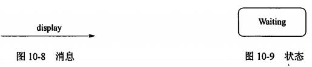

title:: 面向对象技术/UML/事物
alias:: 事物

- UML中有4种事物：结构事物、行为事物、分组事物和注释事物。
- ## 结构事物（structural thing）
	- 结构事物是UML模型中的名词。它们通常是模型的静态部分，描述概念或物理元素。结构事物包括类（class）、接口（interface）、协作（collaboration）、用例（use case）、主动类（active class）、构件（component）和节点（node）。
	- 各种结构事物的图形化表示如图10-7所示。
	  {:height 300, :width 507}
- ## 行为事物（behavior thing）
	- 行为事物是UML模型的动态部分。它们是模型中的动词，描述了跨越时间和空间的行为。共有两类主要的行为事物：交互（interaction）和状态机（state machine）。
	- 交互由在特定语境中共同完成一定任务的一组对象之间交换的消息组成。一个对象群体的行为或单个操作的行为可以用一个交互来描述。交互涉及一些其他元素，包括消息、动作序列（由一个消息所引起的行为）和链（对象间的连接）。在图形上，把一个消息表示为一条有向直线，通常在表示消息的线段上总有操作名。如图10-8所示。
	- 状态机描述了一个对象或一个交互在生命期内响应事件所经历的状态序列。单个类或一组类之间协作的行为可以用状态机来描述。一个状态机涉及到一些其他元素，包括状态、转换（从一个状态到另一个状态的流）、事件（触发转换的事物）和活动（对一个转换的响应）。在图形上，把状态表示为一个圆角矩形，通常在圆角矩形中含有状态的名称及其子状态，如图10-9所示。
	  {:height 92, :width 397}
- ## 分组事物（grouping thing）
	- 分组事物是UML模型的组织部分。它们是一些由模型分解成的“盒子”。在所有的分组事物中，最主要的分组事物是包（package）。包是把元素组织成组的机制，这种机制具有多种用途。结构事物、行为事物甚至其他分组事物都可以放进包内。包不像构件（仅在运行时存在），它纯粹是概念上的（即它仅在开发时存在）。包的图形化表示如图10-10所示。
	  {:height 126, :width 142}
- ## 注释事物（annotaional thing）
	- 注释事物是UML模型的解释部分。这些注释事物用来描述、说明和标注模型的任何元素。注解（note）是一种主要的注释事物。注解是一个依附于一个元素或者一组元素之上，对它进行约束或解释的简单符号。注解的图形化表示如图10-11所示。
	  {:height 109, :width 131}