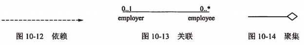
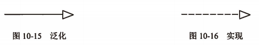

title:: 面向对象技术/UML/关系
alias:: 关系

- UML中有4种关系：依赖、关联、泛化和实现。
- ## 依赖（dependency）
  id:: 6274c8ac-75c5-4dfe-80e3-8bce5ad3cef9
	- 依赖是两个事物间的语义关系，其中一个事物（独立事物）发生变化会影响另一个事物（依赖事物）的语义。在图形上，把一个依赖画成一条可能有方向的虚线，如图10-12所示。
- ## 关联（association）
	- 关联是一种结构关系，它描述了一组链，链是对象之间的连接。聚集（aggregation）是一种特殊类型的关联，它描述了整体和部分间的结构关系。关联和聚集的图形化表示如图10-13和图10-14所示。
	  {:height 80, :width 533}
	- 在关联上可以标注重复度（multiplicity）和角色（role）。
- ## 泛化（generalization）
  id:: 6274c8ac-d9a0-42be-abcb-4cd2b8f02973
	- 泛化是一种特殊/一般关系，特殊元素（子元素）的对象可替代一般元素（父元素）的对象。用这种方法，子元素共享了父元素的结构和行为。在图形上，把一个泛化关系画成一条带有空心箭头的实线，它 <u>指向父元素</u> ，如图10-15所示。
- ## 实现（realization）
	- 实现是类元之间的语义关系，其中一个类元指定了由另一个类元保证执行的契约。在两种地方要遇到实现关系：一种是在接口和实现它们的类或构件之间；另一种是在用例和实现它们的协作之间。在图形上，把一个实现关系画成一条带有空心箭头的虚线，如图10-16所示。
	  {:height 75, :width 409}
- 这4种关系是UML模型中可以包含的基本关系事物。它们也有变体，例如，依赖的变体有精化、跟踪、包含和延伸。