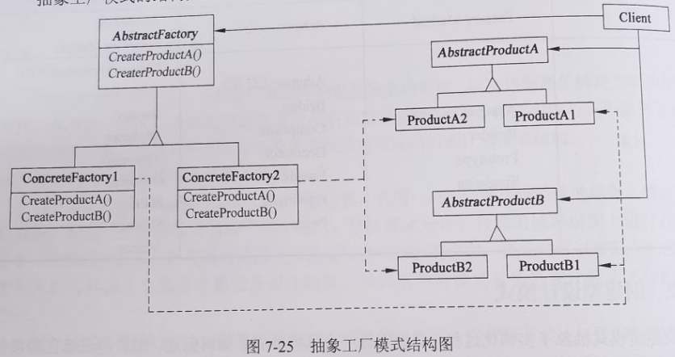
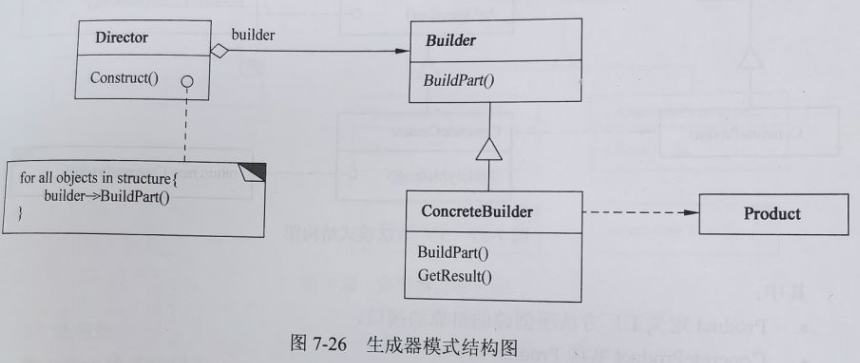
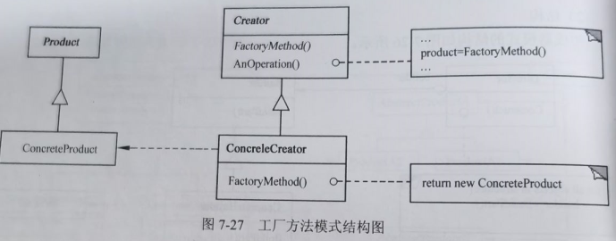
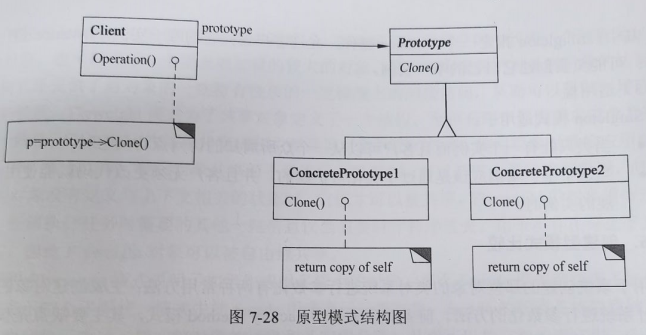
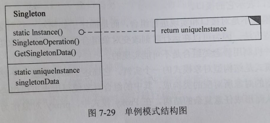

alias:: 创建型设计模式

- 创建型模式抽象了实例化过程，它们帮助一个系统独立于如何创建、组合和表示它的那些对象。一个**类创建型模式**使用继承改变被实例化的类，而一个**对象创建型模式**将实例化委托给另一个对象。
- 随着系统演化得越来越依赖于对象复合而不是类继承，创建型模式变得更为重要。当这种情况发生时，重心从对一组固定行为的硬编码（hard-coding）转移为定义一个较小的基本行为集，这些行为可以被组合成任意数目的更复杂的行为。这样创建有特定行为的对象要求的不仅仅是实例化一个类。
- 在这些模式中有两个不断出现的主旋律。
  第一，它们都将关于该系统使用哪些具体的类的信息封装起来。
  第二，它们隐藏了这些类的实例是如何被创建和放在一起的。整个系统关于这些对象所知道的是由抽象类所定义的接口。
- 因此，创建型模式在什么被创建，谁创建它，它是怎样被创建的，以及何时创建这些方面给予了很大的灵活性。它们允许用结构和功能差别很大的“产品”对象配置一个系统。配置可以是静态的（即在编译时指定），也可以是动态的（在运行时）。
- 【例10.8】Singleton模式。
  collapsed:: true
	- 通常情况下，用户可以对应用系统进行配置，并将配置信息保存在配置文件中。应用系统在启动时首先将配置文件加载到内存中，这些内存配置信息应该有且仅有一份。应用单身模式（Singleton）以保证Configure类只能有一个实例。这样，Configure类的使用者无法定义该类的多个实例，否则会产生编译错误。程序如下：
	- ```c
	  #include <iostream.h>
	  class Configure {
	  protected:
	  Configure(){};
	  
	  public:
	  static Configure* Instance();
	  
	  public:
	  int GetConfigureData() {return data;}
	  int SetConfigureData(int m_data) {data = m_data; return data;}
	  
	  private:
	  static Configure* _instance;
	  int data;
	  }
	  - Configure::_instance = NULL;
	  Configure *Configure::Instance() {
	  if (_instance == NULL) {
	    _instance = new Configure();
	  }
	  return _instance;
	  }
	  - void main() {
	  Configure* t = NULL;
	  t = Instance();
	  int d = t->GetConfigureData();
	  }
	  ```
- ## Abstract Factory 抽象工厂
	- ### 意图
	  collapsed:: true
		- 提供一个创建一系列相关或相互依赖对象的接口，而无须指定它们具体的类。
	- ### 结构
		- 抽象工厂模式的结构如图7-25所示。
		- {:height 298, :width 590}
		- 其中：
		  > 1. AbstractFactory声明一个创建抽象产品对象的操作接口。
		  > 2. ConcreteFactory实现创建具体产品对象的操作。
		  > 3. AbstractProduct为一类产品对象声明一个接口。
		  > 4. ConcreteProduct定义一个将被相应的具体工厂创建的产品对象，实现AbstractProduct接口。
		  > 5. Client仅使用由AbstractFactory和AbstractProduct类声明的接口。
	- ### 适用性
	  collapsed:: true
		- Abstract Factory模式适用于：
		  > 1. 一个系统要独立于它的产品的创建、组合和表示时；
		  > 2. 一个系统要由多个产品系列中的一个来配置时；
		  > 3. 当要强调一系列相关的产品对象的设计以便进行联合使用时。
		  > 4. 当要提供一个产品类库，只想显示它们的接口而不是实现时。
- ## Builder 生成器
	- ### 意图
		- 将一个复杂对象的构建与它的表示分离，使得同样的构建过程可以创建不同的表示。
	- ### 结构
		- 生成器模式的结构如图7-26所示。
		- {:height 267, :width 620}
		- 其中：
		  > 1. Builder为创建一个Product对象的各个部件指定抽象接口。
		  > 2. ConcreteBuilder实现Builder的接口以构造和装配该产品的各个部件，定义并明确它所创建的表示，提供一个检索产品的接口。
		  > 3. Director构造一个使用Builder接口的对象。
		  > 4. Product表示被构造的复杂对象。ConcreteBuilder创建该产品的内部表示并定义它的装配过程。包含定义组成组件的类，包括将这些组件装配成最终产品的接口。
	- ### 适用性
		- Builder模式适用于：
		  > 1. 当创建复杂对象的算法应该独立于该对象的组成部分以及它们的装配方式时。
		  > 2. 当构造过程必须允许被构造的对象有不同的表示时。
- ## Factory Method 工厂方法
	- ### 意图
		- 定义一个用于创建对象的接口，让子类决定实例化哪一个类。Factory Method使一个类的实例化延迟到其子类。
	- ### 结构
		- 工厂方法模式的结构如图7-27所示。
		- {:height 241, :width 599}
		- 其中：
			- > 1. Product定义工厂方法所创建的对象的接口。
			  > 2. ConcreteProduct实现Product接口。
			  > 3. Creator 声明工厂方法，该方法返回一个Product类型的对象。Creator也可以定义一个工厂方法的默认实现，它返回一个默认的ConcreteProduct对象，可以调用工厂方法以创建一个Product对象。
			  > 4. ConcreteCreator重定义工厂方法以返回一个ConcreteProduct实例。
	- ### 适用性
		- Factory Method模式适用于：
			- > 1. 当一个类不知道它所必须创建的对象的类的时候。
			  > 2. 当一个类希望由它的子类来指定它所创建的对象的时候。
			  > 3. 当类将创建对象的职责委托给多个帮助子类中的某一个，并且你希望将哪一个帮助子类是代理者这一信息局部化的时候。
- ## Prototype 原型
	- ### 意图
		- 用原型实例指定创建对象的种类，并且通过复制这些原型创建新的对象。
	- ### 结构
		- 原型模式的结构如图7-28所示。
		- {:height 263, :width 496}
		- 其中：
			- > 1. Prototype声明一个复制自身的接口。
			  > 2. ConcretePrototype实现一个复制自身的操作
			  > 3. Client让一个原型复制自身从而创建一个新的对象。
	- ### 适用性
		- Prototype模式适用于：
			- > 1. 当一个系统应该独立于它的产品创建、构成和表示时；
			  > 2. 当要实例化的类是在运行时刻指定时，例如，通过动态装载；
			  > 3. 为了避免创建一个与产品类层次平行的工厂类层次时。
			  > 4. 当一个类的实例只能有几个不同状态组合中的一种时。建立相应数目的原型并克隆它们，可能比每次用合适的状态手工实例化该类更方便一些。
- ## Singleton 单例
	- ### 意图
		- 保证一个类仅有一个实例，并提供一个访问它的全局访问点。
	- ### 结构
		- 单例模式的结构如图7-29所示。
		- {:height 216, :width 476}
		- 其中：Singleton指定一个Instance操作，允许客户访问它的唯一实例，Instance是一个类操作；可能负责创建它自己的唯一实例。
	- ### 适用性
		- Singleton模式适用于：
			- > 1. 当类只能有一个实例而且客户可以从一个众所周知的访问点访问它时。
			  > 2. 当这个唯一实例应该是通过子类化可扩展的，并且客户无须更改代码就能使用一个扩展的实例时。
- ## 创建型模式比较
	- 用于系统创建的那些对象的类对系统进行参数化有两种常用方法：生成创建对象的类的子类和对系统进行参数化的方法。前者对应于使用Factory Method模式，其主要缺点是仅为了改变产品类就可能需要创建一个新的子类。这种改变可能级联发生，例如，如果产品的创建者本身是一个工厂方法创建的，那么也必须重定义它的创建者。后者更多地依赖于对象的复合，定义一个对象负责明确产品对象的类，并将它作为该系统的参数。这是Abstract Factory、Builder和Prototype模式的关键特征，都涉及创建一个新的负责创建产品对象的“工厂对象”。Abstract Factory由这个工厂对象产生多个对象。Builder由这个工厂对象使用一个相对复杂的协议，逐步创建一个复杂产品。Prototype由该工厂对象通过复制原型对象来创建产品对象。在这种情况下，由于原型负责返回产品对象，所以工厂对象和原型是同一个对象。