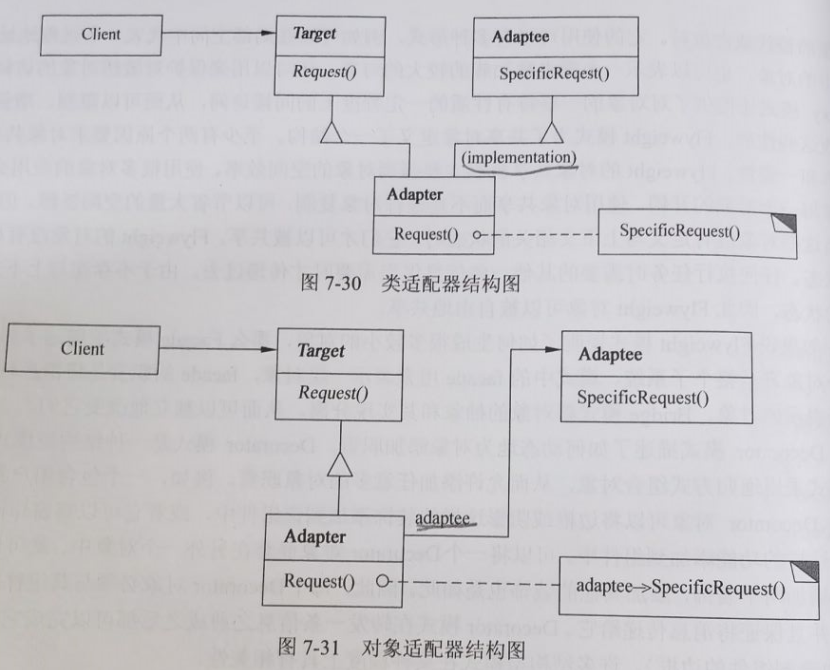
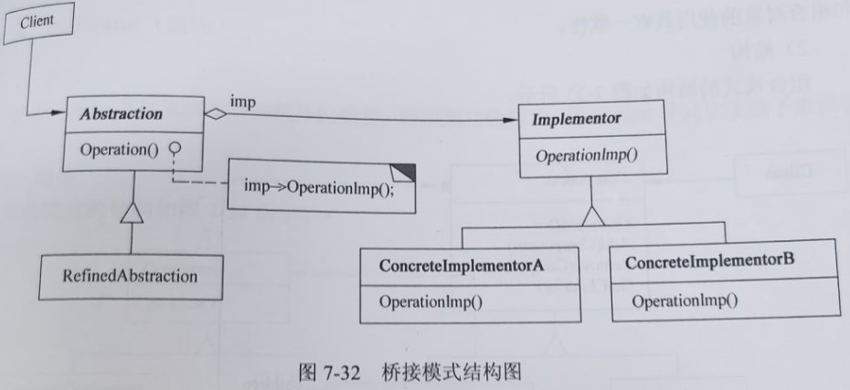
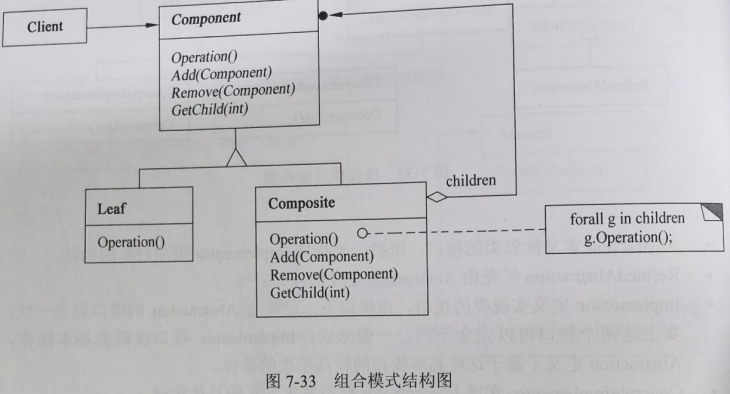
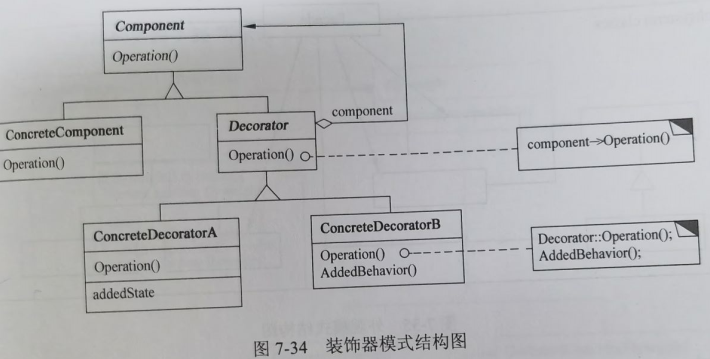
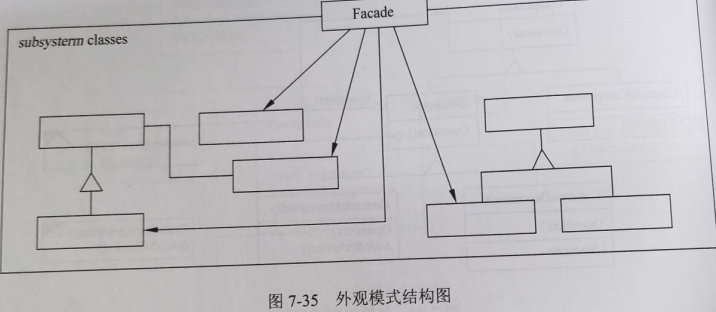
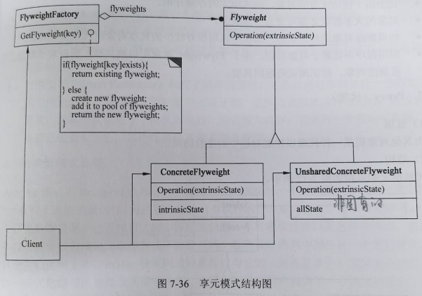
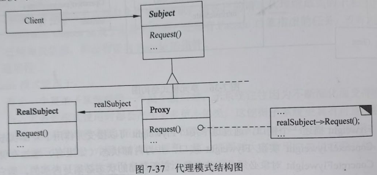

filters:: {"索引" false}
alias:: 结构型设计模式

- 结构型设计模式涉及如何组合类和对象以获得更大的结构。结构型类模式采用继承机制来组合接口或实现。一个简单的例子是采用多重继承方法将两个以上的类组合成一个类，结果这个类包含了所有父类的性质。这一模式尤其有助于多个独立开发的类库协同工作。其中一个例子是类形式的Adapter模式。一般来说，适配器使得一个接口与其他接口兼容，从而给出了多个不同接口的统一抽象。为此，类适配器对一个adaptee类进行私有继承。这样，适配器就可以用adaptee的接口表示它的接口。
- 结构型对象模式不是对接口和实现进行组合，而是描述了如何对一些对象进行组合，从而实现新功能的一些方法。因为可以在运行时刻改变对象组合关系，所以对象组合方式具有更大的灵活性，而这种机制用静态类组合是不可能实现的。
- **Composite模式**是结构型对象模式的一个实例。它描述了如何构造一个类层次式结构，这一结构由两种类型的对象所对应的类构成。其中的组合对象使得用户可以组合基元对象以及其他的组合对象，从而形成任意复杂的结构。
- 在**Proxy模式**中，proxy对象作为其他对象的一个方便的替代或占位符。它的使用可以有多种形式，例如可以在局部空间中代表一个远程地址空间中的对象，也可以表示一个要求被加载的较大的对象，还可以用来保护对敏感对象的访问。Proxy模式还提供了对对象的一些特有性质的一定程度上的间接访问，从而可以限制、增强或修改这些性质。
- **Flyweight( 享元)模式**为了共享对象定义了一个结构。至少有两个原因要求对象共享：效率和一致性。Flyweight的对象共享机制主要强调==对象的空间效率==。使用很多对象的应用必须考虑每一个对象的开销。使用对象共享而不是进行对象复制，可以节省大量的空间资源。但是，仅当这些对象没有定义与上下文相关的状态时，它们才可以被共享。Flyweight的对象没有这样的状态。任何执行任务时需要的其他一些信息仅当需要时才传递过去。由于不存在与上下文相关的状态，因此Flyweight对象可以被自由地共享。
- 如果说Flyweight模式说明了如何生成很多较小的对象，那么**Facade模式**则描述了如何用单个对象表示整个子系统。模式中的facade用来表示一组对象，facade的职责是将消息转发给它所表示的对象。
- **Bridge模式**将对象的抽象和其实现分离，从而可以独立地改变它们。
- **Decorator模式**描述了如何动态地为对象添加职责。Decorator模式是一种结构型模式，这一模式采用递归方式组合对象，从而允许添加任意多的对象职责。例如，一个包含用户界面组件的Decorator对象可以将边框或阴影这样的装饰添加到该组件中，或者它可以将窗口滚动和缩放这样的功能添加到组件中。可以将一个Decorator对象嵌套在另外一个对象中，就可以很简单地增加两个装饰，添加其他的装饰也是如此。因此，每个Decorator对象必须与其组件的接口兼容并且保证将消息传递给它。Decorator模式在转发一条信息之前或之后都可以完成它的工作（例如绘制组件的边框）。许多结构型模式在某种程度上具有相关性。
- ## Adapter 适配器
	- ### 意图
	  collapsed:: true
		- 将一个类的接口转换成客户希望的另外一个接口。Adapter模式使得原本由于接口不兼容而不能一起工作的那些类可以一起工作。
	- ### 结构
	  collapsed:: true
		- 类适配器使用多重继承对一个接口与另一个接口进行匹配，其结构如图7-30所示。对象适配器依赖于对象组合，其结构如图7-31所示。
		- {:height 479, :width 589}
		- 其中：
			- > 1. Target定义Client使用的与特定领域相关的接口
			  > 2. Client与符合Target接口的对象协同
			  > 3. Adaptee定义一个已经存在的接口，这个接口需要适配
			  > 4. Adapter对Adaptee的接口与Target接口进行适配
	- ### 适用性
	  collapsed:: true
		- Adapter模式适用于：
			- > 1. 想使用一个已经存在的类，而它的接口不符合要求
			  > 2. 想创建一个可以服用的类，该类可以与其他不相关的类或不可预见的类（即那些接口可能不一定兼容的类）协同工作
			  > 3. （仅适用于对象Adapter）想使用一个已经存在的子类，但是不可能对每一个都进行子类化以匹配它们的接口。对象适配器可以适配它的父类接口。
- ## Bridge 桥接
	- ### 意图
	  collapsed:: true
		- 将抽象部分与其实现部分分离，使它们都可以独立地变化。
	- ### 结构
	  collapsed:: true
		- 桥接模式的结构如图7-32所示。
		- {:height 289, :width 618}
		- 其中：
			- > 1. Abstraction定义抽象类的接口，维护一个指向Implementor类型对象的指针。
			  > 2. RefinedAbstraction扩充由Abstraction定义的接口。
			  > 3. Implementor定义实现类的接口，该接口不一定要与Abstraction的接口完全一致；事实上这两个接口可以完全不同。一般来说，Implementor接口仅提供基本操作，而Abstraction定义了基于这些基本操作的较高层次的操作。
			  > 4. ConcreteImplementor实现Implementor接口并定义它的具体实现。
	- ### 适用性
	  collapsed:: true
		- Bridge模式适用于：
			- > 1. 不希望在抽象和它的实现部分之间有一个固定的绑定关系。例如，这种情况可能是因为，在程序运行时刻实现部分应可以被选择或者切换。
			  > 2. 类的抽象以及它的实现都应该可以通过生成子类的方法加以扩充。这是Bridge模式使得开发者可以对不同的抽象接口和实现部分进行组合，并分别对它们进行扩充。
			  > 3. 对一个抽象的实现部分的修改应对客户不产生影响，即客户代码不必重新编译。
			  > 4. （C++）想对客户完全隐藏抽象的实现部分。
			  > 5. 有许多类要生成的类层次结构。
			  > 6. 想在多个对象间共享实现（可能使用引用计数），但同时要求客户并不知道这一点。
- ## Composite 组合
	- ### 意图
	  collapsed:: true
		- 将对象组合成树型结构以表示“部分-整体”的层次结构。Composite使得用户对单个对象和组合对象的使用具有一致性。
	- ### 结构
	  collapsed:: true
		- 组合模式的结构如图7-33所示。
		- {:height 332, :width 606}
		- 其中：
			- > 1. Component为组合中的对象声明接口；在适当情况下实现所有类共有接口的默认行为；声明一个接口用于访问和管理Component的子组件；（可选）在递归结构中定义一个接口，用于访问一个父组件，并在合适的情况下实现它。
			  > 2. Leaf在组合中表示叶结点对象，叶结点没有子结点；在组合中定义图元对象的行为。
			  > 3. Composite定义有子组件的那些组件的行为；存储子组件；在Component接口中实现与子组件有关的操作。
			  > 4. Client通过Component接口操纵组合组件的对象。
	- ### 适用性
	  collapsed:: true
		- Composite模式适用于：
			- > 1. 想表示对象的部分-整体层次结构。
			  > 2. 希望用户忽略组合对象与单个对象的不同，用户将统一地使用组合结构中的所有对象。
- ## Decorator 装饰
	- ### 意图
	  collapsed:: true
		- 动态地给一个对象添加一些额外的职责。就增加功能而言，Decorator模式比生成子类更加灵活。
	- ### 结构
	  collapsed:: true
		- 装饰模式的结构如图7-34所示。
		- {:height 268, :width 516}
		- 其中：
			- > 1. Component定义一个对象接口，可以给这些对象动态地添加职责。
			  > 2. ConcreteComponent定义一个对象，可以给这个对象添加一些职责。
			  > 3. Decorator维持一个指向Component对象的指针，并定义一个与Component接口一致的接口。
			  > 4. ConcreteDecorator向组件添加职责。
	- ### 适用性
	  collapsed:: true
		- Decorator模式适用于：
			- > 1. 在不影响其他对象的情况下，以动态、透明的方式给单个对象添加职责。
			  > 2. 处理那些可以撤销的职责。
			  > 3. 当不能采用生成子类的方式进行扩充时。一种情况是，可能有大量独立的扩展，为支持每一种组合将产生大量的子类，使得子类数目呈爆炸性增长。另一种情况可能是，由于类定义被隐藏，或类定义不能用于生成子类。
- ## Facade 外观
	- ### 意图
	  collapsed:: true
		- 为子系统中的一组接口提供一个一致的界面，Facade模式定义了一个高层接口，这个接口使得这一子系统更加容易使用。
	- ### 结构
	  collapsed:: true
		- 外观模式的结构如图7-35所示。
		- {:height 261, :width 580}
		- 其中：
			- > 1. Facade知道哪些子系统类负责处理请求；将客户的请求代理给适当的子系统对象。
			  > 2. Subsystem classes实现子系统的功能；处理有Facade对象指派的任务；没有Facade的任何相关信息，即没有指向Facade的指针。
	- ### 适用性
	  collapsed:: true
		- Facade模式适用于：
			- > 1. 要为一个复杂子系统提供一个简单接口时，子系统往往因为不断演化而变得越来越复杂。大多数模式使用时都会产生更多更小的类，这使得子系统更具有可重用性，也更容易对子系统进行定制，但也给那些不需要定制子系统的用户带来一些使用上的困难。Facade可以提供一个简单的默认视图，这一视图对大多数用户来说已经足够，而那些需要更多的可定制性的用户可以越过Facade层。
			  > 2. 客户程序与抽象类的实现部分之间存在着很大的依赖性。引入Facade将这个子系统与客户以及其他的子系统分离，可以提高子系统的独立性和可移植性。
			  > 3. 当需要构建一个层次结构的子系统时，使用Facade模式定义子系统中每层的入口点。如果子系统之间是相互依赖的，则可以让它们仅通过Facade进行通信，从而简化了它们之间的依赖关系。
- ## Flyweight 享元
	- ### 意图
	  collapsed:: true
		- 运用共享技术有效地支持大量细粒度的对象。
	- ### 结构
		- 享元模式的结构如图7-36所示。
		- {:height 396, :width 561}
		- 其中：
			- > 1. Flyweight描述一个接口，通过这个接口Flyweight可以接受并作用于外部状态。
			  > 2. ConcreteFlyweight实现Flyweight接口，并为内部状态（如果有）增加存储空间。
			  > ConcreteFlyweight对象必须是可共享的。它所存储的状态必须是内部的，即它必须独立于ConcreteFlyweight对象的场景。
			  > 3. 并非所有的Flyweight子类都需要被共享。Flyweight接口使共享成为可能，但它并不强制共享。在Flyweight对象结构的某些层次，UnsharedConcreteFlyweight对象通常将CocreteFlyweight对象作为子结点。
			  > 4. Client维持一个对Flyweight的引用；计算或存储一个或多个Flyweight的外部状态。
	- ### 适用性
		- Flyweight模式适用于：
			- > 1. 一个应用程序使用了大量的对象；
			  > 2. 完全由于使用大量的对象，造成很大的存储开销；
			  > 3. 对象的大多数状态都可变为外部状态。
			  > 4. 如果删除对象的外部状态，那么可以用相对较少的共享对象取代很多组对象；
			  > 5. 应用程序不依赖于对象标识。由于Flyweight对象可以被共享，所以对于概念上明显有别的对象，标识测试将返回真值。
- ## Proxy 代理
	- ### 意图
		- 为其他对象提供一种代理以控制对这个对象的访问。
	- ### 结构
		- 代理模式的结构如图7-37所示。
		- {:height 272, :width 570}
		- > 1. Proxy保存一个引用使得代理可以访问实体；提供一个与Subject的接口相同的接口，使代理可以用来代替实体；控制对实体的存取，并可能负责创建和删除它；其他功能依赖于代理的类型：Remote Proxy负责对请求及其参数进行编码，并向不同地址空间中的实体发送已编码的请求；Virtual Proxy可以缓存实体的附加信息，以便延迟对它的访问；Protection Proxy检查调用者是否具有实现一个请求所必需的访问权限。
		  > 2. Subject 定义RealSubject和Proxy的共用接口，这样就在任何使用RealSubject的地方都可以使用Proxy。
		  > 3. RealSubject定义Proxy所代表的实体。
	- ### 适用性
		- Proxy模式适用于在需要比较通用和复杂的对象指针代替简单的指针的时候，常见情况有：
			- > 1. 远程代理（Remote Proxy）为一个对象在不同地址空间提供局部代表。
			  > 2. 虚代理（Virtual Proxy）根据需要创建开销很大的对象。
			  > 3. 保护代理（Protection Proxy）控制对原始对象的访问，用于对象应该有不同的访问权限的时候。
			  > 4. 智能引用（Smart Reference）取代了简单的指针，它在访问对象时执行一些附加操作。典型用途包括：对指向实际对象的引用计数，这样当该对象没有引用时，可以被自动释放；当第一次引用一个持久对象时，将它装入内存；在访问一个实际对象前，检查是否已经锁定了它，以确保其他对象不能改变它。
- ## 结构型模式比较
	- Adapter模式和Bridge模式具有一些功能特征，都给另一个对象提供了一定程度上的间接性，因而有利于系统的灵活性，另外都涉及从自身以外的一个接口向这个对象转发请求。Adapter模式主要是为解决两个已有接口之间不匹配的问题，不考虑这些接口是怎样实现的，也不考虑它们各自可能会如何演化。这种方式不需要对两个独立设计的类中的任何一个进行重新设计，就能够使它们协同工作。Bridge模式则对抽象接口与它的（可能是多个）实现部分进行桥接。虽然这一模式允许使用者修改实现它的类，但是它仍然为用户提供了一个稳定的接口，也会在系统演化时适应新的实现。Adapter模式和Bridge模式通常被用于软件生命周期的不同阶段，针对不同的问题。Adapter模式在类已经设计好后实施；而Bridge模式在设计类之前实施。
	- Composite模式和Decorator模式具有类似的结构，说明它们都是基于递归组合来组织可变数目的对象。Decorator旨在能够不需要生成子类即给对象添加职责，这避免了静态实现所有功能组合而导致子类急剧增加。Composite旨在构造类，使多个相关的对象能够以统一的方式处理，而多重对象可以被当作一个对象来处理，重点在于表示。两者通常协同使用。
	- Decorator模式和Proxy模式都描述了怎样为对象提供一定程度上的间接引用。Proxy模式构成一个对象并为用户提供一致的接口，与Decorator模式不同的是，Proxy模式不能动态地添加或分离性质，也不是为递归组合而设计的，它强调一种关系（Proxy与它的实体之间的关系），这种关系可以静态地表达。其目的是，当直接访问一个实体不方便或不符合需要时，为这个实体提供一个替代者，例如，实体在远程设备上，访问受到限制或者实体是持久存储的。在Proxy模式中，实体定义了关键功能，而Proxy提供（或拒绝）对它的访问。在Decorator模式中，组件仅提供了部分功能，而一个或多个Decorator负责完成其他功能。Decorator模式适用于编译时不能（至少不方便）确定对象的全部功能的情况。