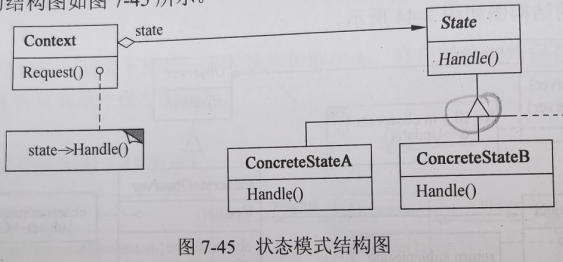

title:: 面向对象技术/设计模式/行为设计模式
alias:: 行为设计模式

- 行为模式涉及到算法和对象间职责的分配。行为模式不仅描述对象或类的模式，还描述它们之间的通信模式。这些模式刻画了在运行时难以跟踪的、复杂的控制流。它们将用户的注意力从控制流转移到对象间的联系方式上来。
- 行为类模式使用继承机制在类间分派行为。本小节包括两个这样的模式，其中Template Method较为简单和常用。模板方法是一个算法的抽象定义，它逐步地定义该算法，每一步调用一个抽象操作或一个原语操作，子类抽象操作以具体实现该算法。另一种行为类模式是Interpreter，它将一个文法表示为一个类层次，并实现一个解释器作为这些类的实例上的一个操作。
- 行为对象模式使用对象复合而不是继承。一些行为对象模式描述了一组对等的对象怎样相互协作以完成其中任一个对象都无法单独完成的任务。这里一个重要的问题是对等的对象。
- 如何互相了解对方。对等对象可以保持显式的对对方的引用，但那会增加它们的耦合度。在极端情况下，每一个对象都要了解所有其他的对象。Mediator在对等对象间引入一个mediator对象以避免这种情况的出现。mediator提供了松耦合所需的间接性。
- Chain of Responsibility提供更松的耦合。它让用户通过一条候选对象链隐式地向一个对象发送请求。根据运行时刻情况任一候选者都可以响应相应的请求。候选者的数目是任意的，可以在运行时刻决定哪些候选者参与到链中。
- Observer模式定义并保持对象间的依赖关系。典型的Observer的例子是Smalltalk中的模型/视图/控制器，其中一旦模型的状态发生变化，模型的所有视图都会得到通知。
- 其他的行为对象模式常将行为封装在一个对象中并将请求指派给它。Strategy模式将算法封装在对象中，这样可以方便地指定和改变一个对象所使用的算法。Command模式将请求封装在对象中，这样它就可作为参数来传递，也可以被存储在历史列表里，或者以其他方式使用。State模式封装一个对象的状态，使得当这个对象的状态对象变化时，该对象可改变它的行为。Visitor封装分布于多个类之间的行为，而Iterator抽象了访问和遍历一个集合中的对象的方式。
- 【例10.9】Observer模式。
  collapsed:: true
	- 在一公文处理系统中，开发者定义了一个公文类OfficeDoc，其中定义了公文具有的属性和处理公文的相应方法。当公文的内容或状态发生变化时，关注此OfficeDoc类对象的相应的DocExplorer对象的内容或状态发生变化时，所有与之相关联的DocExplorer对象都将得到通知，这种应用被称为观察者模式。
	- 程序如下：
	  ```c
	  #include <iostream>
	  const OBS_MAXNUM=20; // 最多与OfficeDoc对象相关联的DocExplorer对象的个数
	  class OfficeDoc;
	  - class DocExplorer {
	  public:
	  DocExplorer(OfficeDoc *doc);
	  virtual void update(OfficeDoc *doc) = 0; // 更新自身状态的函数
	  //其他相关属性和方法省略
	  }
	  - class OfficeDoc {
	  private:
	  DocExplorer *myObs[OBS_MAXNUM];
	  // 关注此公文类的DocExplorer类对象指针数组
	  int index; // 与OfficeDoc对象关联的DocExplorer对象的个数
	  
	  public:
	  OfficeDoc(){
	    index=0;
	  }
	  void attach(DocExplorer *o) {
	    // 将一DocExplorer对象与OfficeDoc对象相关联
	    if(index >= OBS_MAXNUM || o == NULL) return;
	    for (int loop = 0; loop < index; loop++)
	      if(myObs[loop] == 0) return;
	    myObs[index] = 0;
	    index++;
	  }
	  void detach(DocExplorer *o) {
	    // 解除某DocExplorer对象与OfficeDoc对象的关联
	    if(o == NULL) return;
	    for(int loop = 0; loop < index; loop++) {
	      if (myObs[loop] == o) {
	        if (loop <= index-1) myObs[loop] = myObs[index-1];
	        myObs[index-1] = NULL;
	        index--;
	        break;
	      }
	    }
	  }
	  
	  private:
	  void notifyObs() {
	    for(int loop = 0; loop < index; loop++) {
	      myObs[loop]->update(this); // DocExplorer对象更新自身状态
	    }
	  }
	  
	  // 其他公文类的相关属性和方法
	  };
	  - DocExplorer::DocExplorer(OfficeDoc *doc) { // DocExplorer类对象的构造函数
	  doc->attach(this); // 将此DocExplorer对象与doc对象相关联
	  }
	  ```
- ## Chain of Responsibility 责任链
	- ### 意图
	  collapsed:: true
		- 使多个对象都有机会处理请求，从而避免请求的发送者和接收者之间的耦合关系。将这些对象连成一条链，并沿着这条链传递该请求，直到有一个对象处理它为止。
	- ### 结构
	  collapsed:: true
		- 责任链模式的结构图如图7-38所示。
		- {:height 274, :width 445}
		- 其中：
			- > 1. Handler定义一个处理请求的接口；（可选）实现后继链。
			  > 2. ConcreteHandler处理它所负责的请求；可访问它的后继者；如果可处理该请求，就处理它，否则将该请求转发给后继者。
			  > 3. Client向链上的具体处理者（ConcreteHandler）对象提交请求。
	- ### 适用性
	  collapsed:: true
		- Chain of Responsibility模式适用于以下条件：
			- > 1. 有多个对象可以处理一个请求，哪个对象处理该请求运行时刻自动确定。
			  > 2. 想在不明确指定接收者的情况下向多个对象中的一个提交一个请求。
			  > 3. 可处理一个请求的对象集合应被动态指定。
- ## Command 命令
	- ### 意图
	  collapsed:: true
		- 将一个请求封装为一个对象，从而使得可以用不同的请求对客户进行参数化；对请求排队或记录请求日志，以及支持可撤销的操作。
	- ### 结构
	  collapsed:: true
		- 命令模式的结构图如图7-39所示。
		- {:height 212, :width 546}
		- 其中：
			- > 1. Command声明执行操作的接口。
			  > 2. ConcreteCommand将一个接收者对象绑定于一个动作；调用接收者相应的操作，以实现Execute。
			  > 3. Client创建一个具体命令对象并设定它的接收者。
			  > 4. Invoker要求该命令执行这个请求。
			  > 5. Receiver知道如何实施与执行一个请求相关的操作。任何类都可能作为一个接收者。
	- ### 适用性
	  collapsed:: true
		- Command模式适用于：
			- > 1. 抽象出待执行的动作以参数化某对象。Command模式是过程语言中的回调（Callback）机制的一个面向对象的替代品。
			  > 2. 在不同的时刻指定、排列和执行请求。一个Command对象可以有一个与初始请求无关的生存期。如果一个请求的接收者可用一种与地址空间无关的方式表达，那么就可以将负责该请求的命令对象传递给另一个不同的进程并在那实现该请求。
			  > 3. 支持取消操作。Command的Execute操作可在实施操作前将状态存储起来，在取消操作时这个状态用来消除该操作的影响。Command接口必须添加一个Unexecute操作，该操作取消上一次Execute调用的效果。执行的命令被存储在一个历史列表中。可通过向后和向前遍历这一列表并分别调用Unexecute和Execute来实现重数不限的“取消”和“重做”。
			  > 4. 支持修改日志。这样当系统崩溃时，这些修改可以被重做一遍。在Command接口中添加装载操作和存储操作，可以用来保持变动的一个一致的修改日志。从崩溃中恢复的过程包括从磁盘中重新读入记录下来的命令并用Execute操作重新执行它们。
			  > 5. 用构建在原语操作上的高层操作构造一个系统。这样一种结构在支持事务（Transaction）的信息系统中很常见。Command模式提供了对事务进行建模的方法。Command有一个公共接口，使得可以用同一种方式调用所有的事务，同时使用该模式也易于添加新事务以扩展系统。
- ## Interpreter 解释器
	- ### 意图
		- 给定一个语言，定义它的文法的一种表示，并定义一个解释器，这个解释器使用该表示来解释语言中的句子。
	- ### 结构
		- 解释器模式的结构图如图7-40所示。
		- {:height 279, :width 465}
		- 其中：
			- > 1. AbstractExpression声明一个程序的解释操作，这个接口为抽象语法树中所有的结点所共享。
			  > 2. TerminalExpression实现与文法中的终结符相关联的解释操作；一个句子中的每个终结符需要该类的一个实例。
			  > 3. NonterminalExpression对文法中的每一条规则都需要一个NonterminalExpression类；为每个符号都维护一个AbstractExpression类型的实例变量；为文法中的非终结符实现解释操作。
			  > 4. Context包含解释器之外的一些全局信息。
			  > 5. Client构建（或被给定）表示该文法定义的语言中一个特定的句子的抽象语法树，该抽象语法树由NonterminalExpression和TerminalExpression的实例装配而成；调用解释操作。
	- ### 适用性
		- Interpreter模式适用于当有一个语言需要解释执行，并且可将该语言中的句子表示为一个抽象语法树，以下情况效果最好：
			- > 1. 该文法简单。对于复杂的发文，文法的类层次变得庞大而无法管理。此时语法分析程序生成器这样的工具是更好的选择。它们无须构建抽象语法树即可解释表达式，这样可以节省空间还可能节省时间。
			  > 2. 效率不是一个关键问题。最高效的解释器通常不是通过直接解释语法分析树实现的，而是首先将它们转换成另一种形式。不过，即使在这种情况下，转换器仍然可用该模式实现。
- ## Iterator 迭代器
	- ### 意图
		- 提供一种方法顺序访问一个聚合对象中的各个元素，且不需要暴露该对象的内部表示。
	- ### 结构
		- 迭代器模式的结构图如图7-41所示。
		- {:height 300, :width 567}
		- 其中：
			- > 1. Iterator（迭代器）定义访问和遍历元素的接口。
			  > 2. ConcreteIterator（具体迭代器）实现迭代器接口；对该聚合遍历时跟踪当前位置。
			  > 3. Aggregate（聚合）定义创建相应迭代器对象的接口。
			  > 4. ConcreteAggregate（具体聚合）实现创建相应迭代器的接口，该操作返回ConcreteIterator的一个适当的实例。
	- ### 适用性
		- Iterator模式适用于：
			- > 1. 访问一个聚合对象的内容而无须暴露它的内部表示。
			  > 2. 支持对聚合对象的多种遍历。
			  > 3. 为遍历不同的聚合结构提供一个统一的接口。
- ## Mediator 中介者
	- ### 意图
		- 用一个中介对象来封装一系列的对象交互。中介者使各对象不需要显式地相互引用，从而使其耦合松散，而且可以独立地改变它们之间的交互。
	- ### 结构
		- 中介者模式的结构图如图7-42所示。
		- {:height 188, :width 557}
		- 其中：
			- > 1. Mediator（中介者）定义一个接口适用于各同事（Colleague）对象通信。
			  > 2. ConcreteMediator（具体中介者）通过协调各同事对象实现协作行为；了解并维护它的各个同事。
			  > 3. Colleague class（同事类）知道它的中介者对象；每一个同事类对象在需要与其他同事通信的时候与它的中介者通信。
	- ### 适用性
		- Mediator模式适用于：
			- > 1. 一组对象以定义良好但是复杂的方式进行通信，产生的相互依赖关系结构混乱且难以理解。
			  > 2. 一个对象引用其他很多对象并且直接与这些对象通信，导致难以利用该对象。
			  > 3. 想定制一个分布在多个类中的行为，而又不想生成太多的子类。
- ## Memento 备忘录
	- ### 意图
		- 在不破坏封装性的前提下捕获一个对象的内部状态，并在对象之外保存这个状态。这样以后就可以将对象恢复到原先保存的状态。
	- ### 结构
		- 此模式的结构图如图7-43所示。
		- {:height 201, :width 500}
		- 其中：
			- > 1. Memento（备忘录）存储原发器对象的内部状态，原发器根据需要决定备忘录存储原发器的哪些内部状态；防止原发器以外的其他对象访问备忘录。
			  > 2. Originator（原发器）创建一个备忘录，用于记录当前时刻它的内部状态；使用备忘录恢复内部状态。
			  > 3. Caretaker（管理者）负责保存好备忘录；不时对备忘录的内容进行操作或检查。
	- ### 适用性
		- Memento模式适用于：
			- > 1. 必须保存一个对象在某一个时刻的（部分）状态，这样以后需要时它才能恢复到先前的状态。
			  > 2. 如果一个用接口来让其他对象直接得到这些状态，将会暴露对象的实现细节并破坏对象的封装性。
- ## Observer 观察者
	- ### 意图
		- 定义对象间的一种一对多的依赖关系，当一个对象的状态发生改变时，所有依赖于它的对象都得到通知并被自动更新。
	- ### 结构
		- 观察者模式的结构图如图7-44所示。
		- {:height 258, :width 569}
		- 其中：
			- > 1. Subject（目标）知道它的观察者，可以有任意多个观察者观察同一个目标；提供注册和删除观察者对象的接口。
			  > 2. Observer（观察者）为那些在目标发生改变时需获得通知的对象定义一个更新接口。
			  > 3. ConcreteSubject（具体目标）将有关状态存入各ConcreteObserver对象；当它的状态发生改变时，向它的各个观察者发出通知。
			  > 4. ConcreteObserver（具体观察者）维护一个指向ConcreteSubject对象的引用；存储有关状态，这些状态应与目标的状态保持一致；实现Observer的更新接口，以使自身状态与目标的状态保持一致。
	- ### 适用性
		- Observer模式适用于：
			- > 1. 当一个抽象模式有两个方面，其中一个方面依赖于另一个方面，将这两者封装在独立的对象中以使它们可以各自独立地改变和复用。
			  > 2. 当对一个对象的改变需要同时改变其他对象，而不知道具体有多少对象有待改变时。
			  > 3. 当一个对象必须通知其他对象，而它又不能假定其他对象是谁，即不希望这些对象是紧耦合的。
- ## State 状态
	- ### 意图
		- 允许一个对象在其内部状态改变时改变它的行为。对象看起来似乎修改了它的类。
	- ### 结构
		- 状态模式的结构图如图7-45所示。
		- {:height 209, :width 439}
		- 其中：
			- > 1. Context（上下文）定义客户感兴趣的接口；维护一个ConcreteState子类的实例，这个实例定义当前状态。
			  > 2. State（状态）定义一个接口以封装与Context的一个特定状态相关的行为。
			  > 3. ConcreteState（具体状态子类）每个子类实现与Context的一个状态相关的行为。
	- ### 适用性
		- State模式适用于：
			- > 1. 一个对象的行为决定于它的状态，并且它必须在运行时刻根据状态改变它的行为。
			  > 2. 一个操作中含有庞大的多分支的条件语句，且这些分支依赖于该对象的状态。这个状态常用一个或多个枚举常量表示。通常，有多个操作包含这一相同的条件结构。State模式将每一个条件分支放入一个独立的类中。这使得开发者可以根据对象自身的情况将对象的状态作为一个对象，这一对象可以不依赖于其他对象独立变化。
- ## Strategy 策略
	- ### 意图
		- 定义一系列的算法，把它们一个个封装起来，并且使它们可以相互替换。此模式使得算法可以独立于使用它们的客户而变化。
	- ### 结构
		- 策略模式的结构图如图7-46所示。
		- {:height 208, :width 499}
		- 其中：
			- > 1. Strategy（策略）定义所有支持的算法的公共接口。Context使用这个接口来调用某ConcreteStrategy定义的算法。
			  > 2. ConcreteStrategy（具体策略）以Strategy接口实现某具体算法。
			  > 3. Context（上下文）用一个ConcreteStrategy对象来配置；维护一个对Strategy对象的引用；可定义一个接口来让Strategy访问它的数据。
	- ### 适用性
		- Strategy模式适用于：
			- > 1. 许多相关的类仅仅是行为有异。“策略”提供了一种用多个行为中的一个行为来配置一个类的方法。
			  > 2. 需要使用一个算法的不同变体。例如，定义一些反映不同空间的空间/时间权衡的算法。当这些变体实现为一个算法的类层次时，可以使用策略模式。
			  > 3. 算法使用客户不应该知道的数据。可使用策略模式以避免暴露复杂的、与算法相关的数据结构。
			  > 4. 一个类定义了多种行为，并且这些行为在这个类的操作中以多个条件语句的形式出现，将相关的条件分支移入它们各自的Strategy类中，以代替这些条件语句。
- ## Template Method 模板方法
	- ### 意图
		- 定义一个操作中的算法骨架，而将一些步骤延迟到子类中。Template Method使得子类可以不改变一个算法的结构即可重定义该算法的某些特定步骤。
	- ### 结构
		- 模板方法模式的结构图如图7-47所示。
		- {:height 293, :width 431}
		- 其中：
			- > 1. AbstractClass（抽象类）定义抽象的原语操作，具体的子类将重定义它们以实现一个算法的各步骤；实现模板方法，定一个算法的骨架，该模板方法不仅调用原语操作，也调用定义在AbstractClass或其他对象中的操作。
			  > 2. ConcreteClass（具体类）实现原语操作以完成算法中与特定子类相关的步骤。
	- ### 适用性
		- Template Method模式适用于：
			- > 1. 一次性实现一个算法的不变的部分，并将可变的行为留给子类来实现。
			  > 2. 各子类中公共的行为应被提取出来并集中到一个公共父类中，以避免代码重复。
			  > 3. 控制子类扩展。模板方法旨在特定点调用“hook”操作（默认的行为，子类可以在必要时进行重定义扩展），这就只允许在这些点进行扩展。
- ## Visitor 访问者
	- ### 意图
		- 表示一个作用于某对象结构中的各元素的操作。它允许在不改变各元素的类的前提下定义作用于这些元素的新操作。
	- ### 结构
		- 访问者模式的结构图如图7-48所示。
		- {:height 431, :width 484}
		- 其中：
			- > 1. Visitor（访问者）为该对象结构中ConcreteElement的每一个类声明一个Visit操作。该操作的名字和特征标识了发送Visit请求给该访问者的那个类，这使得访问者可以确定正被访问元素的具体的类。这样访问者就可以通过该元素的特定接口直接访问它。
			  > 2. ConcreteVisitor（具体访问者）实现每个有Visitor声明的操作，每个操作实现本算法的一部分，而该算法片段乃是对应于结构中对象的类。ConcreteVisitor为该算法提供了上下文并存储它的局部状态。这一状态常常在遍历该结构的过程中累积结果。
			  > 3. Element（元素）定义以一个访问者为参数的Accept操作。
			  > 4. ConcreteElement（具体元素）实现以一个访问者为参数的Accept操作。
			  > 5. ObjectStructure（对象结构）能枚举它的元素；可以提供一个高层的接口以允许该访问者访问它的元素；可以是一个组合或者一个集合，如一个列表或一个无序集合。
	- ### 适用性
		- Visitor模式适用于：
			- > 1. 一个对象结构包含很多类对象，它们有不同的接口，而用户想对这些对象实施一些依赖于其具体类的操作。
			  > 2. 需要对一个对象结构中的对象进行很多不同的并且不相关的操作，而又想要避免这些操作“污染”这些对象的类。Visitor使得用户可以将相关的操作集中起来定义在一个类中。当该对象结构被很多应用共享时，用Visitor模式让每个应用仅包含需要用到的操作。
			  > 3. 定义对象结构的类很少改变，但经常需要在此结构上定义新的操作。改变对象结构类需要重定义对所有访问者的接口，这可能需要很大的代价。如果对象结构类经常改变，那么可能还是在这些类中定义这些操作较好。
- ## 行为模式比较
	- 很多行为模式注重封装变化。当一个程序的某个方面的特征经常发生改变时，这些模式就定义一个封装这个方面的对象。这样，当该程序的其他部分依赖于这个方面时，它们都可以与此对象协作。这些模式通常定义一个抽象类来描述这些封装变化的对象，并且通常该模式依据这个对象来命名。例如：
		- > 1. 一个Strategy对象封装一个算法。
		  > 2. 一个State对象封装一个与状态相关的行为。
		  > 3. 一个Mediator对象封装对象间的协议。
		  > 4. 一个Iterator对象封装访问和遍历一个聚集对象中的各个组件的方法。
	- 这些模式描述了程序中很可能会改变的方面。大多数模式有两种对象：封装该方面特征的新对象和使用这些新对象的已有对象。但并非所有的对象行为模式都有这样的分割功能，例如，Chain of Responsibility可以处理任意数目的对象（即一个链），而所有这些对象可能已经存在于系统中了。这也说明了行为模式的另一个不同点：并非所有的行为模式都定义类之间的静态通信关系。
	- 一些模式引入总是被用作参数的对象。例如Visitor，一个Visitor对象是一个多态的Accept操作的参数，这个操作作用于该Visitor对象访问的对象。其他模式定义一些可作为令牌进行传递的对象，这些对象将在稍后被调用。例如，Command和Memento。在Command中，令牌代表一个请求；在Memento中，令牌代表一个对象在某个特定时刻的内部状态。在这两种情况下，令牌都可以有一个复杂的内部表示，但客户并不会意识到这一点。另外，在Command模式中多态特别重要，这是因为执行Command对象是一个多态操作。而Memento接口非常小，以至于备忘录只能作为一个值传递，因此，它很可能根本不给它的客户提供任何接口非常小，以至于备忘录只能作为一个值传递，因此，它很可能根本不给它的客户提供任何多态操作。
	- Mediator和Observer是相互竞争的模式，它们之间的差别是：Observer通过引入Observer和Subject对象来分布通信，而Mediator对象则封装了其他对象间的通信。Observer模式中不存在封装一个约束的单个对象，而必须是Observer和Subject对象相互协作来维护这个约束。通信模式由Observer和Subject连接的方式决定：一个Subject通常有多个Observer，并且有时一个Subject的Observer也是另一个Observer的目标。Observer模式有利于Observer和Subject之间的分割和松耦合，易于产生更细粒度且更易于复用的类。Mediator模式的目的是集中而不是分布，它将维护一个约束的职责直接放在一个中间者中。
	- Command、Observer、Mediator和Chain of Responsibility等模式都涉及如何对发送者和接收者解耦，但各自有不同的权衡考虑。
	- Command模式使用一个Command对象来定义一个发送者和一个接收者之间的绑定关系，从而支持解耦。Command对象提供了一个提交请求的简单接口（即Execute操作），将发送者和接收者之间的连接定义在一个对象，使得该发送者可以与不同的接收者一起工作，达到将发送者和接收者之间的连接定义在一个对象，使得该发送者可以与不同的接收者一起工作，达到将发送者和接收者解耦，使发送者更易于复用。此外，可以复用Command对象，用不同的发送者参数化一个接收者。
	- Observer模式通过定义一个接口来通知目标中发生的改变，从而将发送者（目标）与接收者（观察者）解耦。Observer定义了一个比Command更松的发送者-接收者绑定，这是因为一个目标可能有多个观察者，并且其数目可以在运行时变化。此模式中的Subject和Observer接口是为了处理Subject的变化而设计的，因此，当对象间有数据依赖时，最好用此模式来对它们进行解耦。
	- Mediator模式让对象通过一个Mediator对象间接相互引用，从而对它们进行解耦。一个Mediator对象为各Colleague对象间的请求提供路由，并集中它们的通信。因此，各Colleague对象仅能通过Mediator接口相互通信。Mediator接口是固定的，为了增加灵活性，Mediator可能不得不实现它自己的分发策略。可以用一定方式对请求编码并打包参数，使得Colleague对象可以请求的操作数目不限。由于此模式将通信行为集中到一个类中而不是将其分布在各个子类中，所以它可以减少一个系统的子类生成。
	- Chain of Responsibility模式通过沿一个潜在接收者链传递请求而将发送者与接收者解耦。因为发送者和接收者之间的接口是固定的，责任链可能也需要一个定制的分发策略。