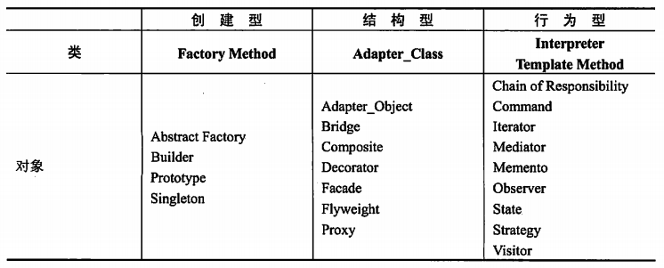
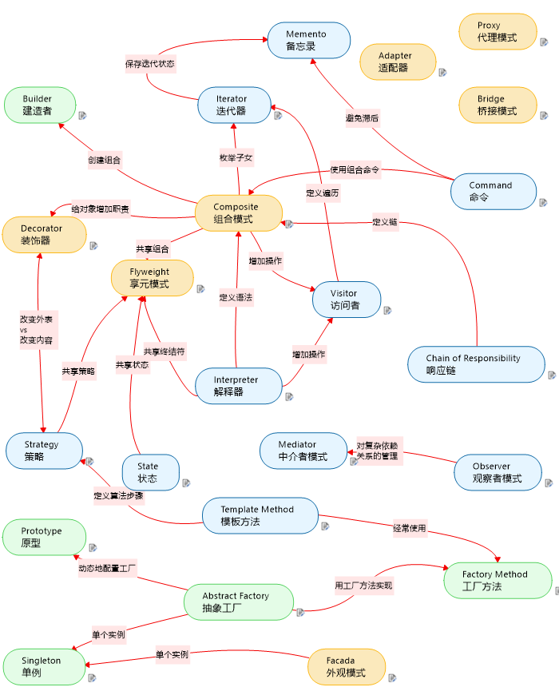

alias:: 设计模式的要素

- “每一个模式描述了一个在我们周围不断重复发生的问题，以及该问题的解决方案的核心。这样，你就能一次又一次地使用该方案而不必做重复劳动”。设计模式的核心在于提供了相关问题的解决方案，使得人们可以更加简单方便地复用成功的设计和体系结构。
- 设计模式一般有如下4个要素。
	- **模式名称**（pattern name）。一个助记名，它用一两个词来描述模式的问题、解决方案和效果。命名一个新的模式增加了设计词汇。设计模式允许在较高的抽象层次上进行设计。基于一个模式词汇表，就可以讨论模式并在编写文档时使用它们。模式名可以帮助人们思考，便于人们与其他人次序设计思想及设计结果。找到恰当的模式名也是设计模式工作的难点之一。
	- **问题**（problem）。问题描述了应该在何时使用模式。
	  它解释了设计问题和问题存在的前因后果，可能描述了特定的设计问题，如怎样用对象表示算法等；也可能描述了导致不灵活设计的类或对象结构。
	  有时候，问题部分会包括使用模式必须满足的一系列先决条件。
	- **解决方案**（solution）。解决方案描述了设计的组成成分，它们之间的相互关系及各自的职责和协作方式。因为模式就像一个模板，可应用于多种不同场合，所以解决方案并不描述一个特定的具体的设计或实现，而是提供设计问题的抽象描述和怎样用一个具有一般意义的元素组合（类或对象组合）来解决这个问题。
	- **效果**（consequences）。效果描述了模式应用的效果及使用模式应权衡的问题。尽管描述设计决策时，并不总提到模式效果，但它们对于评价设计选择和理解使用模式的代价及好处具有重要意义。软件效果大多关注对时间和空间的衡量，它们也表述了语言和实现问题。因为复用是面向对象设计的要素之一，所以模式效果包括它对系统的灵活性、扩充性或可移植性的影响，显式地列出这些效果对理解和评价这些模式很有帮助。
- 设计模式确定了所包含的类和实例，它们的角色、协作方式以及职责分配。每一个设计模式都集中于一个特定的面向对象设计问题或设计要点，描述了什么时候使用它，在另一些设计约束条件下是否还能使用，以及使用的效果和如何取舍。按照设计模式的目的可以分为三大类，如下表所示。
  {:height 255, :width 619}
- 创建型模式与对象的创建有关；结构型模式处理类或对象的组合；行为型模式对类或对象怎样交互和怎样分配职责进行描述。
- {:height 727, :width 585}