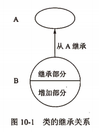
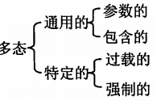

title:: 面向对象技术/面向对象基础/面向对象的基本概念
alias:: 面向对象的基本概念

- Peter Coad和Edward Yourdon提出用下面的等式识别面向对象方法。
  ```
  面向对象 = 对象(object) + 分类(classification) + 继承(inheritance) 
  	+ 通过消息的通信(communication with messages)
  ```
  可以说，采用这4个概念开发的软件系统是面向对象的。
- ## 对象
	- 在面向对象的系统中，对象是基本的运行时的实体，它既包括数据（属性），也包括作用于数据的操作（行为）。所以，一个对象把属性和行为封装为一个整体。==封装==是一种信息隐蔽技术，它的目的是使对象的使用者和生产者分离，使对象的定义和实现分开。从程序设计者来看，对象是一个程序模块；从用户来看，对象为他们提供了所希望的行为。在对象内的操作通常叫做方法。一个对象通常可由对象名、属性和操作三部分组成。
	- 在现实世界中，每个实体都是对象，如学生、汽车、电视机和空调等都是现实世界中的对象。每个对象都有它的属性和操作，如电视机有颜色、音量、亮度、频道等属性，可以有切换频道、增大/减低音量等操作。电视机的属性值表示了电视机所处的状态，而这些属性只能通过其提供的操作来改变。电视机的各组成部分，如显像管、电路板和开关等都封装在电视机机箱中，人们不知道也不关心电视机是如何实现这些操作的。
- ## 消息
	- 对象之间进行通信的一种构造叫做消息。当一个消息发送给某个对象时，包含要求接收对象去执行某些活动的信息。接收到信息的对象经过解释，然后予以响应。这种通信机制叫做消息传递。发送消息的对象不需要知道接收消息的对象如何对请求予以响应。
- ## 类
	- 一个类定义了一组大体上相似的对象。一个类所包含的方法和数据描述一组对象的共同行为和属性。把一组对象的共同特征加以抽象并存储在一个类中的能力，是面向对象技术最重要的一点。是否建立了一个丰富的类库，是衡量一个面向对象程序设计语言成熟与否的重要标志。
	- 类是在对象之上的抽象，对象是类的具体化，是类的实例(instance)。在分析和设计时，通常把注意力集中在类上，而不是具体的对象。也不必为每个对象逐个定义，只需对类作出定义，而对类的属性的不同赋值即可得到该类的对象实例。
	- 有些类之间存在一般和特殊关系，即一些类是某个类的特殊情况，某个类是一些类的一般情况。这是一种 `is-a` 关系，即特殊类是一种一般类。例如“汽车”类、“轮船”类、“飞机”类都是一种“交通工具”类。特殊类是一般类的子类，一般类是特殊类的父类。同样，“汽车”类还可以有更特殊的类，如“轿车“类、”货车“类等。在这种关系下形成一种层次的关联。
	- 通常把一个类和这个类的所有对象称为”类及对象“或对象类。
- ## 继承
	- 继承是父类和子类之间共享数据和方法的机制。这是类之间的一种关系，在定义和实现一个类的时候，可以在一个已经存在的类的基础上来进行，把这个已经存在的类所定义的内容作为自己的内容，并加入若干新的内容。图10-1表示了父类A和它的子类B之间的继承关系。
	  
	- 一个父类可以有多个子类，这些子类都是父类的特例，父类描述了这些子类的公共属性和操作。一个子类可以继承它的父类（或祖先类）中的属性和操作，这些属性和操作在子类中不必定义，子类中还可以定义自己的属性和操作。
	- 图10-1中的B只从一个父类A得到继承，叫做”单重继承“。如果一个子类有两个或更多个父类，则称为”多重继承“。
- ## 多态
	- 在收到消息时，对象要予以响应。不同的对象收到同一消息可以产生完全不同的结果，这一现象叫做多态(polymorphism)。在使用多态的时候，用户可以发送一个通用的消息，而实现的细节则由接收对象自行决定。这样，同一消息就可以调用不同的方法。
	- 多态的实现受到继承的支持，利用类的继承的层次关系，把具有通用功能的消息存放在高层次，而不同的实现这一功能的行为放在较低层次，在这些低层次上生成的对象能够给通用消息以不同的响应。
	- 多态有几种不同的形式，Cardelli和Wegner把它分为4类，如下所示。其中，参数多态和包含多态称为通用的多态，过载多态和强制多态称为特定的多态。
	  
	- **参数多态**是应用比较广泛的多态，被称为最纯的多态。**包含多态**在许多语言中都存在，最常见的例子就是子类型化，即一个类型是另一个类型的子类型。**过载**/重载(overloading)多态是同一个名字在不同的上下文中所代表的含义。
- ## 动态绑定
	- 动态绑定（Dynamic Binding）。绑定是一个把过程调用和响应调用所需要执行的代码加以结合的过程。在一般的程序设计语言中，绑定是在编译时进行的，叫做**静态绑定**。**动态绑定**则是在运行时进行的，因此，一个给定的过程调用和代码的结合直到调用发生时才进行。
	- 动态绑定是和类的继承以及多态相联系的。在继承关系中，子类是父类的一个特例，所以父类对象可以出现的地方，子类对象也可以出现。因此在运行过程中，当一个对象发送消息请求服务时，要根据接收对象的具体情况将请求的操作与实现的方法进行连接，即动态绑定。